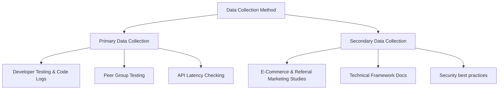

# CHAPTER – 1: INTRODUCTION

## 1.1 Background of the Project

In today's digital world, shopping online has become a regular part of our daily lives. With easy access to high-speed internet, smartphones, and secure online payment methods, more and more people prefer buying products online rather than visiting physical shops. This growth of electronic commerce (e-commerce) has created great opportunities for businesses, but it has also made the online marketplace very competitive. Today, thousands of online shops are competing for the same customers. To attract buyers, companies spend a huge amount of money on digital advertisements, such as Google ads, social media posts, and banners. 

However, traditional digital marketing is becoming more expensive and less effective. Most internet users now ignore advertisements (a problem known as "banner blindness") or use ad-blocking software to hide them. In addition, recent privacy settings on mobile phones make it harder for businesses to target the right audience. As a result, the cost of acquiring new customers is rising, which reduces the profits of e-commerce startups. To solve this problem, online businesses are going back to the most basic and trusted form of marketing: Word-of-Mouth (WoM). People are much more likely to trust a product recommendation if it comes from a friend, classmate, or family member rather than a corporate advertisement on the internet. Referral marketing uses this social trust by rewarding existing customers for bringing in new buyers.

Standard referral programs are simple: a user refers a friend and receives a one-time discount code. While this works well for a short time, it does not encourage long-term growth. To create a self-running viral marketing chain, a multi-tier referral system is much more effective. In a two-level referral system, a user gets rewarded not just for their direct referrals, but also when those referrals bring in new customers. For example, if User A refers User B, and User B refers User C, User A gets a primary "direct" commission when User B buys something, and a secondary "indirect" commission when User C buys something. This creates a network of active promoters who want to share the website to earn passive rewards.

To build such a system, we need a strong, fast, and modern web application framework. The MERN stack—which stands for MongoDB, Express.js, React.js, and Node.js—is the most popular and efficient choice for web development students today. This project, "Referral E-Commerce System", is an e-commerce platform built using the MERN stack that integrates a full online shopping experience with an automated two-level referral program. By combining a shopping cart, dynamic product catalog, safe checkout through the Razorpay payment gateway, and an automated wallet ledger, this project demonstrates how a business can reduce marketing costs and drive growth through technology.

---

## 1.2 Objective of the Project

The main objective of this project is to develop and implement a functional, secure e-commerce web application that features an automated, two-tier referral commission system. The application allows users to browse and buy products online while earning rewards by building their own network of buyers.

To complete the main objective, the following specific secondary objectives must be achieved:
1. **To Design a Responsive Frontend Interface**: Build a user-friendly and highly responsive website using React.js and Tailwind CSS. The interface should allow customers to view the product catalog, read product specifications, manage their shopping carts, and add shipping addresses smoothly.
2. **To Build a Secure Backend API**: Create a backend server using Node.js and Express.js to handle user authentication, shopping cart details, order creation, and wallet calculations.
3. **To Implement Automated Referral Ledger Calculations**: Develop backend database logic that automatically calculates and distributes commissions. When a user buys a product, the system must immediately identify their referrers, calculate Level 1 (direct) and Level 2 (indirect) earnings based on the product’s commission settings, and update the wallets without database errors.
4. **To Integrate Razorpay Payment Gateway**: Incorporate the Razorpay payment API to process real-time mock transactions in Indian Rupees (INR) using credit cards, UPI, and internet banking, using cryptographic verification to ensure all transactions are genuine.
5. **To Create a Dual-Purpose Digital Wallet**: Build a virtual wallet system that displays a user's total earnings, withdrawals, and net balance. The wallet should allow users to redeem their rewards either by converting them into digital gift coupons or by purchasing products directly from the shop.
6. **To Develop an Admin Control Panel**: Create a separate dashboard for administrators to upload new products, manage inventory stock, set product commission rates, update promotional banners, and monitor platform statistics like total users and completed orders.
7. **To Apply System Constraints**: Implement safety features, such as limiting the maximum number of direct referrals per user to 8, to ensure the network tree remains balanced and the database performs efficiently.

---

## 1.3 Scope of the Project

The scope of this project defines the technical boundaries, target functionalities, user roles, and rules of the referral system. This application is designed as a complete web prototype, showcasing both modern frontend design and backend database management.

### Technical Scope
The application is built using standard JavaScript frameworks. The frontend uses React.js alongside Vite for fast development and rendering. Tailwind CSS is used for creating a modern, clean layout that works on desktop computers, tablets, and smartphones. The backend runs on Node.js and Express.js, providing RESTful API routes. MongoDB serves as the database, using Mongoose schemas for managing data structures.

### Functional Scope
The system has two main user categories with different access levels:

1. **User Features**:
   * **Authentication**: Users can sign up, log in, and manage their sessions securely using JSON Web Tokens (JWT). During signup, users can enter a valid referral code.
   * **Store Operations**: Users can search for items, filter by categories, add items to a cart, check stock availability, and manage their shipping addresses.
   * **Payment & Orders**: Users can check out using the Razorpay gateway or pay using their wallet balance.
   * **Dashboard**: A personal profile displaying wallet details, withdrawal history, and a list of referred users at Level 1 and Level 2.
   * **Withdrawals**: A portal to simulate redeeming wallet balances for store vouchers.

2. **Admin Features**:
   * **Product & Category Management**: Dynamic CRUD controls to add, edit, or delete products, categorizations, and homepage banner images.
   * **System Logs**: Visibility into total users, total sales, user wallets, and completed orders.

### System Boundaries
The referral network is limited to a depth of two levels (Level 1 and Level 2). To prevent spam signups and ensure the database handles request queues efficiently, a strict rule is applied: a single user cannot have more than 8 direct (Level 1) referred accounts.

---

## 1.4 Features of the System

The "Referral E-Commerce System" web application includes several key technical features designed to ensure system security, accuracy, and ease of use:

* **Secure Authentication & Onboarding**: The portal uses a secure login and registration setup. User passwords are encrypted on the database using the bcryptjs hashing tool. The backend issues JSON Web Tokens (JWT) for keeping users logged in safely. The registration form is built to detect invitation links: when a user clicks a referral link, the site automatically fills in the referral code, saving time.
* **Shopping Cart & Saved Address Manager**: Users can add multiple products to their cart, change quantities, and check out in one transaction. The cart interacts with the server to check active product inventory stock, preventing users from buying out-of-stock items. Users can also save multiple delivery addresses in their profiles and select a default shipping address.
* **Integrated Razorpay Payments**: The payment workflow is fully automated. When checking out, the server creates a unique Razorpay order ID. The React client displays the checkout interface. Upon payment, the server verifies the payment signature using a SHA256 HMAC hash. Verified payments instantly create order entries and deduct items from inventory.
* **Automated Commission Engine**: When a product is successfully purchased, the system checks if the buyer has referrers.
  * Level 1 Referrer gets the direct commission: `Product Price * (Commission % / 100)`.
  * Level 2 Referrer gets the indirect commission: `Level 1 Commission * 10%`.
  To ensure these database modifications are safe, they are wrapped in MongoDB Session Transactions. If one step fails, the entire update is canceled, preventing incorrect wallet balances.
* **Dual Wallet Utility**: The personal wallet tracks all earnings in real-time. Users can choose to withdraw their balance by generating unique, random voucher codes for top brands (like GIFT-AMZ-XXXXX) or purchase items directly using their wallet balance as a payment method, which also distributes commissions.
* **Interactive Downline Visualizer**: The system provides users with a clean, clear visual list of all their referrals grouped into Level 1 and Level 2. This allows promoters to easily track their network's purchasing activity.
* **Admin Dashboard Hub**: A clean administrative center showing real-time statistics (total earnings, total orders, active users) alongside tables to add or modify products, inventory numbers, and promotional banners.

---

## 1.5 Limitations of the Project

Although the system represents a highly functional e-commerce and referral platform, it has certain limitations in its current prototype stage:

* **Simulated Financial Withdrawals**: The withdrawal process generates mock store voucher codes instead of transferring real money to a user's physical bank account. Implementing real payouts requires corporate merchant accounts and complex banking APIs, which were omitted due to legal and financial registration requirements.
* **Fixed referral Capping**: The limit of 8 direct referrals per user helps prevent spam and ensures the database performs well, but it might restrict large promoters who have thousands of followers and want unlimited direct referrals.
* **Sandbox Database Setup**: The application uses a local sandbox database environment for development testing. It does not include complex database clustering, replication, or memory caching systems (like Redis) required to handle millions of simultaneous users.
* **Local Notifications**: Commission credits and order updates are displayed inside the web application's dashboard. The system does not send real-time alerts via external email servers or SMS networks, which would require commercial API subscriptions.

---

## 1.6 Selection Method of Data Collection

To design and develop a reliable system, a systematic data collection process was followed. This involved both primary and secondary data collection methods, which provided the necessary information to build the database models, user interfaces, and business calculations.

### Primary Data Collection
Primary data was gathered first-hand during the coding and testing phases of the application:
1. **Developer Testing and Code Logs**: Technical data was collected directly from the server runtime logs. Mongoose transaction records, Express API logs, and console debug traces were monitored to check database response times and verify if the commission distributions were mathematically correct.
2. **Peer Group Testing**: A small testing group of 10 classmates was set up to evaluate the system. They registered using referral links, browsed products, added items to the cart, completed checkout using mock payment details, and redeemed gift coupons. Their feedback was used to fix bugs and improve the layout of the user dashboard.
3. **API Latency Checking**: Data regarding the time taken to verify payments and load database collections was analyzed using web browser developer tools to ensure fast page loads.

### Secondary Data Collection
Secondary data consists of information collected from existing publications, official guides, and documentation:
1. **Referral Marketing Studies**: Academic articles and online business guides about referral networks and multi-level commissions were analyzed to set up realistic reward percentages.
2. **Technical Framework Documentation**: The official documentation for the MERN stack—including React.js guides, Express.js API references, Mongoose transaction manuals, and Razorpay SDK documentation—was thoroughly studied to ensure standard coding practices were followed.
3. **Security Best Practices**: Online guides on hashing passwords using bcryptjs, managing sessions with JSON Web Tokens, and avoiding common database injection flaws were researched to secure the application.
