# CHAPTER – 2: METHODOLOGY

## 2.1 Background

In software engineering, a development methodology represents the structured framework of processes, models, and guidelines used to design, build, test, and maintain a software application. Without a well-planned methodology, developing complex web systems can become highly chaotic, leading to database errors, security flaws, and poor user experiences. This is especially true for systems that involve financial transactions and multi-level data tracking, such as the Referral E-Commerce System. Building an application that handles user shopping carts, online payment gateways, and a two-tier referral commission calculation requires a highly disciplined design and coding methodology to ensure that data remains consistent and transactions are executed securely.

For this project, an **Agile/Incremental Development Methodology** was selected. In a student project environment, building a large web application all at once can be overwhelming. The incremental model breaks the software development lifecycle into small, manageable stages or sprints. Each increment focus on building, testing, and integrating a specific module before moving on to the next one. This iterative approach is highly beneficial because it allows for continuous testing and debugging, ensuring that errors in basic functions are fixed before complex systems are built on top of them.

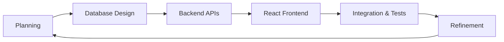

The development was divided into six key incremental stages:
1. **Requirements & Setup**: Setting up the project architecture, establishing Git repositories, and defining folders for the client and server.
2. **User Authentication Module**: Building the secure registration and login routes, implementing bcryptjs encryption, and setting up JSON Web Token (JWT) session generation on the server.
3. **Core Storefront & Cart**: Developing product database models, listing components, quantity selector logic, dynamic shopping carts, and address management.
4. **Razorpay Integration**: Integrating Razorpay payment interface and backend payment verification.
5. **Referral Wallet & Commission Engine**: Developing the mathematical referral calculation logic, handling level 1 and level 2 commissions, and wrapping them in atomic database transaction sessions.
6. **Admin Dashboard and Wallet Redemptions**: Implementing the administrative CRUD systems, platform transaction reports, and simulated voucher code generators for withdrawals.

This methodical, step-by-step approach ensured that every feature was validated and verified before adding subsequent modules, leading to a highly stable final system.

---

## 2.2 Project Description

The "Referral E-Commerce System" is a MERN-stack web application designed to demonstrate a modern online storefront integrated with a two-level referral marketing system. The application serves two main purposes: it provides a smooth, modern shopping experience for regular customers, and it operates an automated digital sales ledger that calculates, records, and distributes commissions to promoters in real-time.

At a high level, the system is composed of three interconnected architectural modules:

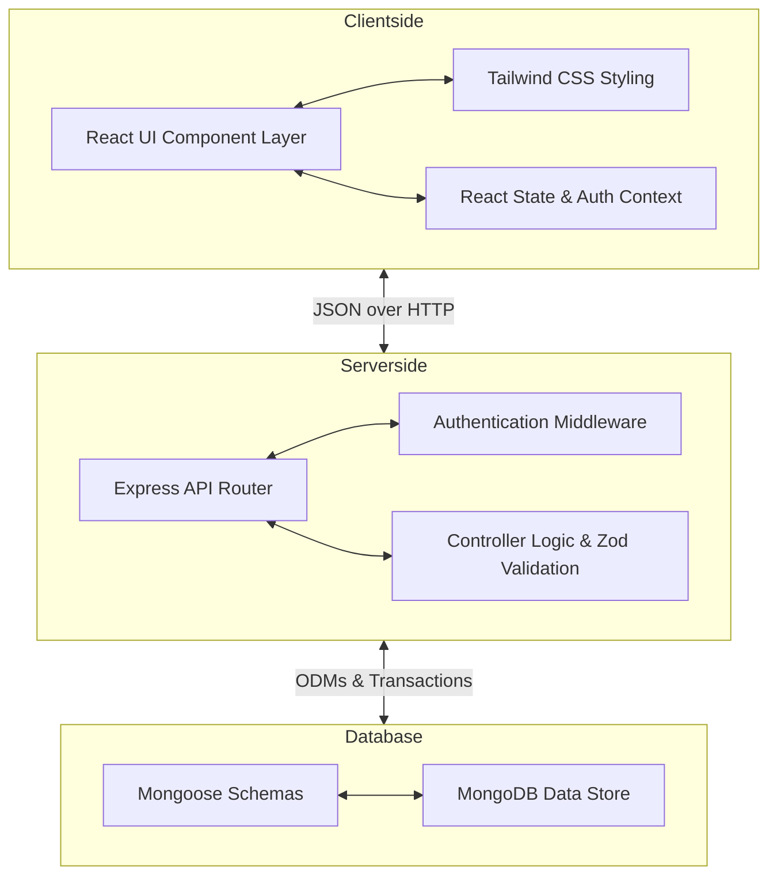

### 1. The Clientside React Interface
The frontend provides a rich, responsive interface where users can interact with the system. Users can browse the catalog of products, search for items, and filter them by category. They can add items to their shopping cart, select delivery addresses from their profile, and make secure purchases. Promoters have a private dashboard where they can see their unique referral code, copy an invitation link, view a list of their Level 1 and Level 2 referrals, track their wallet balance, and redeem their earnings for mock gift cards or buy products directly using wallet funds.

### 2. The Serverside Express API
The backend acts as the brains of the system, processing all API requests from the React client. It exposes endpoints for creating accounts, managing logins, executing shopping cart checkouts, and verifying payments. The backend ensures security by authenticating requests using JWT tokens and validating input data using Zod schema validators before executing any database queries. It also interfaces directly with the Razorpay API to create payment orders.

### 3. The MongoDB Database
MongoDB stores all system data in flexible document structures. Mongoose acts as the Object Data Modeling (ODM) layer on the server, defining clean schemas for users, addresses, products, orders, categories, and banners. The database handles complex relational data—such as user downline paths and earning history ledgers—efficiently, and utilizes database transactions to ensure that commission distributions are executed atomically and safely.

---

## 2.3 System Architecture

The overall system architecture is built on the **MERN (MongoDB, Express, React, Node.js)** framework. This framework is popular because it uses JavaScript across the entire stack, from frontend rendering to database scripting. This unified language structure makes it easy for developers to transfer data structures between client and server.

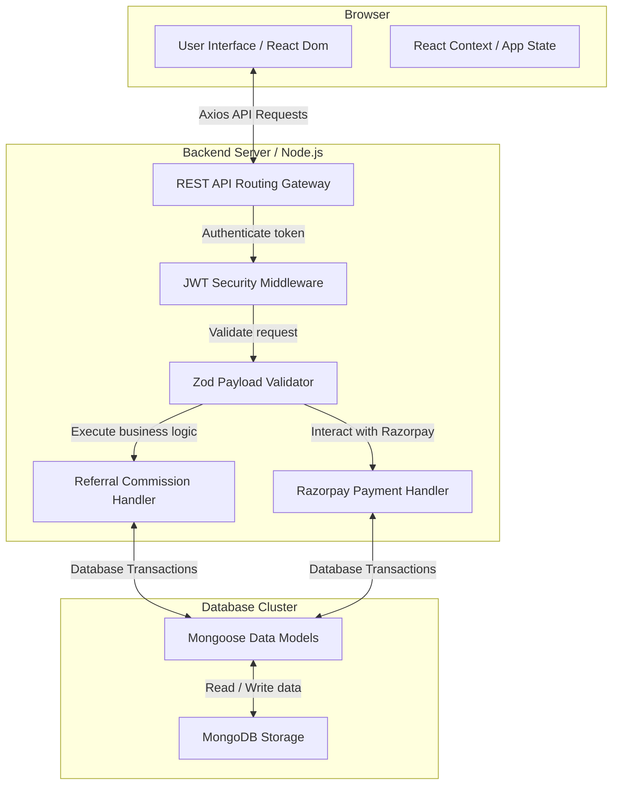

### Component Breakdown:

* **React.js (Frontend Layer)**: Renders dynamic views that update instantly without reloading the entire page. It uses React Router for client-side navigation. It implements a global React Context API (`AuthContext`) to maintain user authentication states, storing the user token locally and attaching it automatically to clientside API requests.
* **Tailwind CSS (Styling Layer)**: Provides responsive, mobile-first CSS styles directly inside HTML elements, ensuring that user dashboards, storefronts, and tables adjust dynamically to different screen dimensions.
* **Express.js (Routing Layer)**: Runs on top of Node.js to receive client HTTP requests, parse JSON payloads, and direct them to modular routers (`auth.js`, `shop.js`, `payment.js`, `admin.js`, `user.js`).
* **Node.js (Server Runtime Layer)**: Executes JavaScript code on the server. Its asynchronous, non-blocking input/output execution model is highly efficient, allowing it to handle many simultaneous API connections from active shoppers and promoters.
* **Mongoose & MongoDB (Database Layer)**: MongoDB stores system data in highly flexible JSON-like documents. Mongoose is a JavaScript framework that allows us to define schemas, validate field types (such as email formats, unique referral codes, and maximum arrays), and write complex queries. 

In this system architecture, the frontend client and the backend server are decoupled. The React frontend interacts with the Express backend solely by sending JSON payloads over HTTP requests, allowing the client and server to scale independently.

---

## 2.4 Client-Server Architecture

The Referral E-Commerce System operates on a stateless **Client-Server Architecture**. In this setup, the frontend user interface (client) and the database-processing backend (server) are separated. The client does not directly access the database, and the server does not handle page layout rendering. They communicate exclusively using REST (Representational State Transfer) API calls over HTTP.

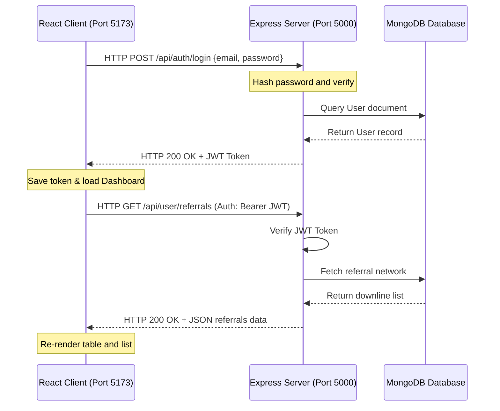

### Communication Flow:
1. **Stateless REST APIs**: The React application runs in the user's browser, while the Express application runs on the server. When the client needs to fetch data (like the product list) or perform an action (like checkout), it sends an HTTP request (GET, POST, PUT, DELETE) containing JSON data.
2. **CORS (Cross-Origin Resource Sharing)**: Since the client and server are running on different ports or domains, the backend server implements CORS middleware. This middleware allows security-controlled communication, permitting the React app client to securely read headers and send request payloads.
3. **Session Management (Stateless JWT)**: Traditional web applications store user session data directly in server memory. This limits scalability. This project uses **JSON Web Tokens (JWT)** for stateless sessions. When a user logs in successfully, the server signs a payload containing the user's ID using a secure backend secret, and sends it back to the client. The client saves this token locally. For any future request to private routes (like checking out or viewing wallet balances), the client includes this token in the request header. The server verifies the token signature, authenticates the user, and processes the request.
4. **Data Exchange format**: All requests and responses are serialized in JSON (JavaScript Object Notation), which guarantees lightweight and high-speed data exchanges.

---

## 2.5 Design Methodology

To ensure that the Referral E-Commerce System was built cleanly, a structured **Software Development Life Cycle (SDLC)** approach was followed. The project went through six developmental phases, ensuring that requirements were gathered, database relationships were modeled, backend code was tested, and user interfaces were polished before final release.

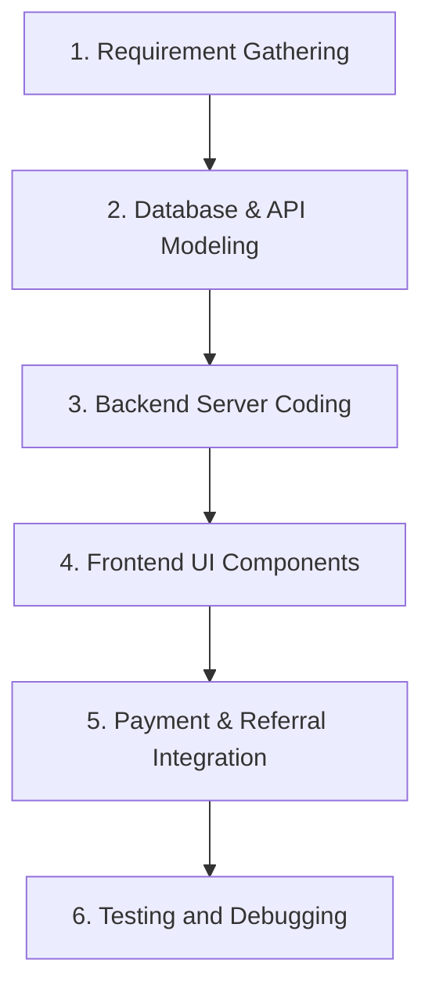

### 1. Requirement Gathering and Analysis
In this initial stage, the functional and non-functional goals of the system were identified. The core requirements were defined: we needed an online catalog where users could purchase items, a secure checkout process, a two-level commission structure for referral payouts, and a maximum direct referral width of 8 active signups to prevent database overflow.

### 2. Database & API Modeling
The database structures were mapped out by drafting Mongoose schemas for users, products, orders, categories, and banners. The REST API routes were structured logically:
* `/api/auth` for signup and login paths.
* `/api/user` for profiles, addresses, and referral trees.
* `/api/shop` for products and categories.
* `/api/payment` for Razorpay orders and wallet checkouts.
* `/api/admin` for platform administration.

### 3. Backend Server Coding
The Express.js backend was developed with modular routing files, validation schemas using Zod, and encryption libraries like bcryptjs. In this phase, Mongoose transactions were introduced to wrap checkout operations, ensuring that stock counts and commission wallets update atomically without database errors.

### 4. Frontend UI Components
Using React, individual interface components were built, such as navigation bars, product cards, category filters, and address selection overlays. Tailwind CSS was applied to design custom, mobile-responsive layout blocks, dashboard grids, and typography structures.

### 5. Payment and Referral Integration
The React client was connected to the Razorpay SDK widget to open payment overlays. The Express backend was integrated with the official Razorpay SDK to create orders and verify transaction signatures using SHA256 HMAC cryptographic hashing. The two-tier referral logic was hooked into successful checkout callbacks.

### 6. Testing and Debugging
A testing phase was carried out to verify all calculations. Mock transactions were processed using dummy payment profiles, verifying that the Level 1 parent received the direct commission and the Level 2 parent received their 10% indirect share. The 8-referral cap was validated by trying to register 9 users under the same code, ensuring the system rejected the 9th registration as expected.

---

## 2.6 Data Flow Diagram (DFD)

A Data Flow Diagram (DFD) visually represents how data moves through a software system, showing the sources of information, the processes that modify data, and where the information is stored. 

### DFD Level 0 (Context Diagram)
The Context Diagram represents the entire Referral E-Commerce System as a single process, showing the direct interactions between the system and its external entities: the User, the Admin, and the Razorpay Gateway.

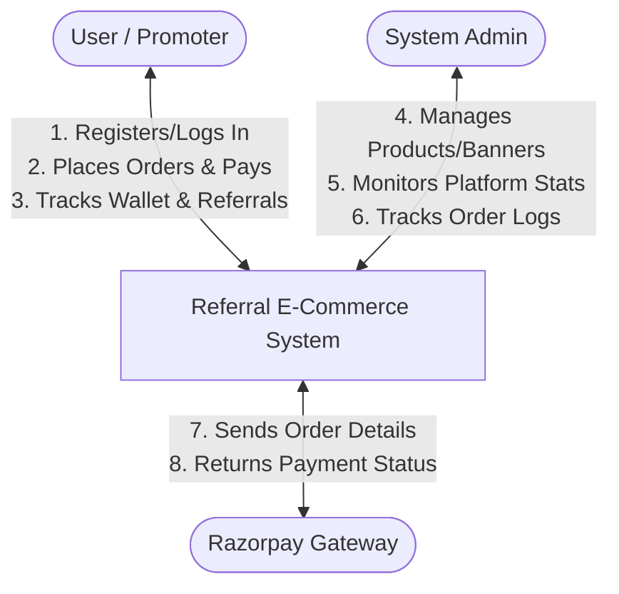

* **User Flows**: The user inputs credentials to log in, registers using a referral code, adds products to their cart, inputs delivery addresses, and receives order confirmations and wallet credits.
* **Admin Flows**: The admin inputs new product profiles and active promotional banners, receiving live platform sales logs and system-wide order summaries.
* **Razorpay Flows**: The system submits order details (amount, currency) and receives cryptographic payment confirmations.

---

### DFD Level 1 (Process Breakdown Diagram)
The DFD Level 1 diagram breaks the main system process into its four core sub-processes, showing how data interacts with specific database storage tables (collections):

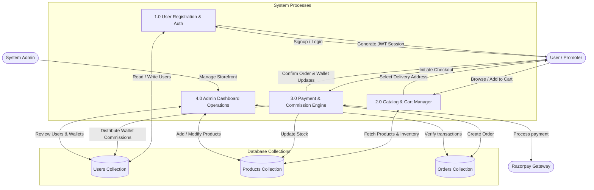

* **Process 1.0 (Auth)**: Handles signup/login, validates referral codes, and registers users into the **Users Collection**.
* **Process 2.0 (Cart)**: Allows users to search and add items, checking active item quantities in the **Products Collection**.
* **Process 3.0 (Checkout)**: Integrates with Razorpay to verify signatures, saves records to the **Orders Collection**, reduces product stock in the **Products Collection**, and distributes commissions across parent nodes in the **Users Collection**.
* **Process 4.0 (Admin)**: Provides tools for admins to update catalog lists and view platform reports from all database collections.

---

## 2.7 ER Diagram

The Entity-Relationship (ER) Diagram defines the structural entities inside our MongoDB database, their respective attributes (fields), and how they relate to one another.

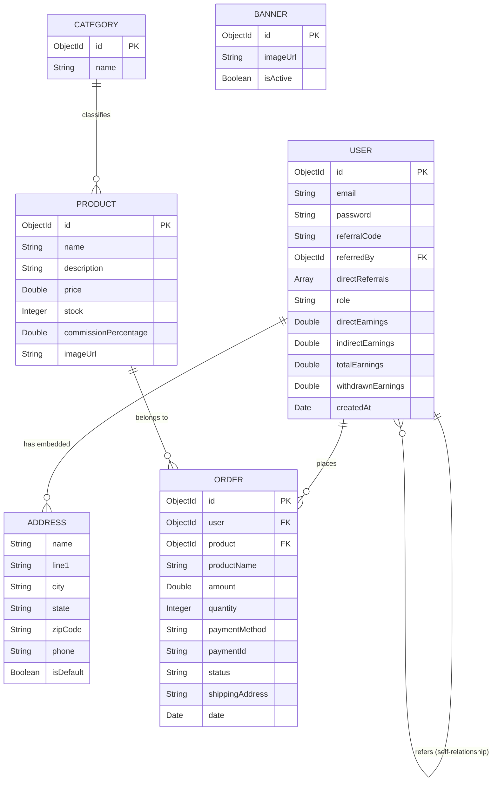

### Key Relationships explained:
1. **User and Address (One-to-Many Embedded)**: Every User document contains an array of `addresses` sub-documents. This embedded structure is efficient because a user's addresses are retrieved instantly alongside their main profile data.
2. **User and Order (One-to-Many)**: A single User can place multiple Orders over time. The `Order` entity stores a foreign key referencing the `User` ID.
3. **User Self-Referential Relationship (One-to-Many)**: A user's profile can store a `referredBy` field that holds the MongoDB ObjectId of another User (their Level 1 Parent). This recursive relationship is what forms the nested referral downline tree.
4. **Product and Order (One-to-Many)**: A Product can be purchased across different orders. The `Order` entity stores the `productId` as a reference alongside the purchase amount and quantity.
5. **Category and Product (Many-to-One)**: Products are classified into specific Categories, allowing user storefronts to filter items dynamically.

---

## 2.8 Flowcharts

Flowcharts represent the step-by-step operational workflows and logical algorithms that execute inside our application. Two major processes demonstrate the complex business logic of our Referral E-Commerce System:

### 1. User Sign Up and Referral Binding Flowchart
This flowchart explains the step-by-step validation that runs when a new user registers on the website:

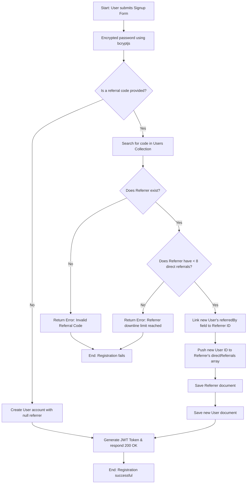

---

### 2. Payment Verification and Commission Payout Flowchart
This flowchart maps out the backend transaction logic that runs when a user completes a checkout payment:

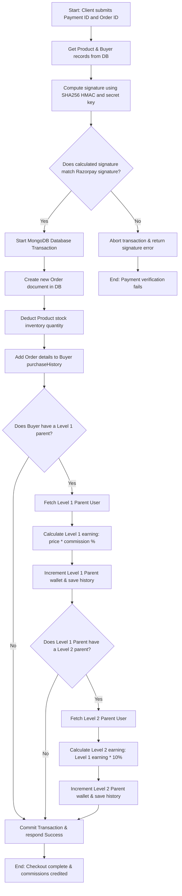

This clear, logical layout ensures that the calculation of direct and indirect rewards is executed safely and cleanly, preventing database anomalies and ensuring system stability.

---

## 2.9 Feasibility Study

A feasibility study is an essential phase in the Software Development Life Cycle (SDLC). It determines whether the proposed Referral E-Commerce System is practical, cost-effective, and beneficial to develop within the given resource and time limits. This evaluation helps identify potential risks and obstacles before allocating substantial development resources. 

For this project, the feasibility of the system was thoroughly evaluated across four key dimensions: **Technical Feasibility**, **Operational Feasibility**, **Economic (Cost) Feasibility**, and **Time Feasibility**.

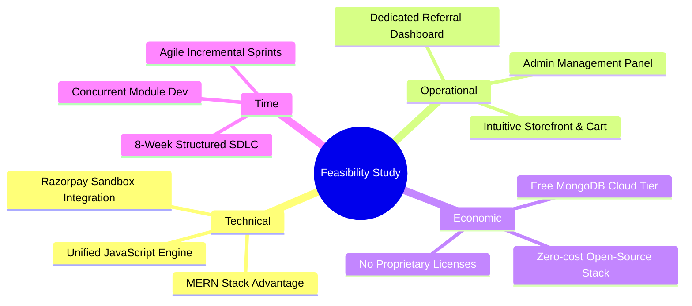

### 2.9.1 Technical Feasibility

Technical feasibility evaluates whether the available hardware, software, and technology stack can support the development and operational requirements of the system. 

The Referral E-Commerce System is built using the **MERN (MongoDB, Express.js, React.js, Node.js) stack**. This technology combination is highly feasible and suitable for this project due to the following reasons:

1. **Unified JavaScript Stack**: By utilizing JavaScript for both frontend rendering (React) and backend services (Node.js/Express), the development overhead was significantly reduced. This unified language model allowed smooth, immediate transfer of data objects (JSON) without needing complex type-casting across boundaries.
2. **Non-Blocking Node.js Server**: The asynchronous, single-threaded nature of Node.js is ideal for handling concurrent requests. In an e-commerce platform where multiple promoters copy referral links and customers browse the store simultaneously, Node.js handles input/output requests without resource bottlenecks.
3. **Flexible Document Database**: MongoDB's schema-less document structure is extremely suitable for representational changes. Promoter hierarchies—such as the `directReferrals` array and recursive `referredBy` linkages—are represented naturally as JSON objects.
4. **Third-Party Payment Sandboxing**: The integration of the official **Razorpay API** provides a highly secure and technically simple payment interface. By operating inside Razorpay’s free developer sandbox environment, the system utilizes real payment simulation without requiring commercial licenses, SSL certificates, or financial regulatory compliance.
5. **Standard Client Requirements**: The frontend React app is lightweight and runs in any modern web browser. The server and database can run comfortably on standard, consumer-grade development laptops (e.g., dual-core processors with 8GB RAM), ensuring zero hardware constraints.

Ultimately, because the developer had access to modern JavaScript modules, secure sandboxing interfaces, and standard workstation resources, the system is **highly technically feasible**.

### 2.9.2 Operational Feasibility

Operational feasibility assesses how well the developed software solves the target problem and how easily it will be adopted, operated, and maintained by its end users (customers, promoters, and administrators).

The system was designed from the ground up to ensure maximum user friendliness and operational efficiency:

1. **Intuitive Customer Storefront**: The storefront layout mirrors standard e-commerce websites (with category search tabs, dynamic shopping carts, and immediate checkout buttons). A customer requires zero technical training to complete a purchase.
2. **Simplified Promoter Console**: Promoters are provided with a dedicated, secure dashboard showing their customized referral invitation link, downline grid, and transaction ledgers. With a single click, they can copy links, monitor their levels 1 and 2 referral trees, and see exactly where their wallet earnings originate.
3. **Simulated Redemption Mechanics**: To keep operations lightweight, promoter redemptions are simulated via secure digital gift vouchers. Rather than dealing with bank transfers and complex compliance, promoters instantly generate brand coupons (like Amazon or Flipkart), allowing immediate, automated gratification.
4. **Comprehensive Admin Control**: The admin dashboard gives system managers full visibility. Admins can audit all orders, update shipping states, modify product parameters (pricing, active stock, referral percentages), and view global financial stats.
5. **No System Training Overhead**: The entire platform operates in standard web browsers, making it accessible on mobile devices and desktops alike. Users require no external manuals or dedicated instruction, making the platform **100% operationally feasible**.

### 2.9.3 Economic (Cost) Feasibility

Economic feasibility determines whether the financial benefits of the system justify the development and maintenance costs. In a university project environment, economic feasibility focuses on minimizing development overhead while ensuring maximum system stability.

The Referral E-Commerce System is **exceptionally cost-feasible** because it was developed entirely using free, open-source software and developer-tier cloud services:

| Component | Software / Resource | Development Cost | Production License Cost |
| :--- | :--- | :--- | :--- |
| **Development IDE** | Visual Studio Code | 0 INR (Open Source) | 0 INR (Free) |
| **Frameworks** | React.js, Express.js, Node.js | 0 INR (MIT License) | 0 INR (Free) |
| **Database** | MongoDB (Local Community Server / Atlas Free Tier) | 0 INR (Free Tier) | 0 INR (Up to 512MB free) |
| **Styling** | Tailwind CSS / Vanilla CSS | 0 INR (Open Source) | 0 INR (Free) |
| **Payment Gateway** | Razorpay SDK (Sandbox Test Environment) | 0 INR (Free Sandbox) | Transaction-based (No upfront cost) |
| **Testing Client** | Postman Client | 0 INR (Free Tier) | 0 INR (Free) |
| **Version Control** | GitHub | 0 INR (Free Public/Private repos) | 0 INR (Free) |

* **Zero Cash Outlay**: The actual development of this system incurred **zero cost** for licensing. All tools, databases, package dependencies (like `bcryptjs` and `jsonwebtoken`), and IDE software are completely free.
* **Low Hosting Barriers**: For small-scale testing and academic viva demonstrations, the entire platform is hosted locally on the developer's laptop (Port `5173` for React and Port `5000` for Express). If cloud deployment is needed, the system can be deployed onto free/low-cost platforms (like Vercel for frontend, Render for backend, and MongoDB Atlas for database), keeping operational costs negligible.

Thus, the economic analysis confirms that the project delivers high functional value at a development cost of zero, proving it is **fully economically feasible**.

### 2.9.4 Time Feasibility

Time feasibility evaluates whether the project can be planned, designed, coded, tested, and documented within the academic deadline. The total developmental timeline for the Referral E-Commerce System was mapped over a structured **8-week academic schedule** using the **Agile/Incremental SDLC model**.

```mermaid
gantt
    title Development Timeline (8-Week SDLC Schedule)
    dateFormat  X
    axisFormat %d
    
    section Phase 1
    Requirements & Architecture :active, 0, 7
    section Phase 2
    Database setup & Auth APIs  : 7, 18
    section Phase 3
    Storefront & Shopping Cart : 18, 28
    section Phase 4
    Razorpay & Wallet Engine : 28, 42
    section Phase 5
    Admin Control & Vouchers  : 42, 49
    section Phase 6
    Testing, Debugging & Thesis : 49, 56
```

The developmental sprints were organized as follows:
* **Week 1 (Requirements Analysis and Interface Mockups)**: Gathering system goals, sketching UI dashboards, and designing the database Entity-Relationship schema.
* **Week 2 to 2.5 (Database Setup and Authentication Core)**: Configuring Mongoose models, establishing MongoDB local storage, coding user signup/login APIs, and creating JWT route guards.
* **Week 2.5 to 4 (Core Storefront and Shopping Cart)**: Building category department listings, dynamic cart components, and shipping address managers.
* **Week 4 to 6 (Payment Integration and Referral Calculations)**: Integrating Razorpay payment sheets, checking HMAC signatures, and implementing the Level 1 and Level 2 database transaction commission credits.
* **Week 6 to 7 (Admin Dashboard and Redemptions)**: Designing the admin console interface, and generating simulated Amazon/Flipkart voucher codes.
* **Week 8 (Testing, Bug Resolution, and Documentation)**: Performing system-wide tests (including the 8-referral spillover cap), resolving cart inventory bugs, and compiling the final thesis report.

By dividing the application into standalone, modular sprints and developing APIs and React layouts in parallel, the developer successfully prevented bottlenecks. The project was completed on schedule, confirming that it is **entirely time feasible**.

---

## 2.10 Data Dictionary and Decision Tables

System analysis and design requires the construction and evaluation of data catalogs and logical decision matrices. These tools ensure that database constraints are fully documented and backend routing decisions are mathematically consistent. 

To satisfy the academic project report criteria, this section provides the formal **Data Dictionary** for the database collections and the **Decision Tables** governing the system's core business logic.

### 2.10.1 Data Dictionary

A Data Dictionary acts as a centralized metadata repository that defines the exact structure, data types, keys, and validation rules for each attribute stored in the database. Since the system utilizes **MongoDB** (a document-oriented database), data structures are stored as flexible documents. Mongoose schemas enforce structural constraints at the application layer.

The data dictionaries for the three primary collections—**Users**, **Products**, and **Orders**—are detailed below:

#### 1. Users Collection Data Dictionary (`users`)

This collection stores promoter profiles, encrypted credentials, referral tree linkages, dynamic wallets balances, and embedded transaction sub-schemas (addresses and withdrawal logs).

| Field Attribute Name | Data Type | Key / Constraint | Validation / Defaults | Operational Description |
| :--- | :---: | :---: | :--- | :--- |
| `_id` | ObjectId | Primary Key | Auto-generated by MongoDB | Unique identifier for the user document. |
| `email` | String | Unique Index | Required, unique, email regex check | Primary user email address used for login. |
| `password` | String | None | Required, encrypted using bcryptjs | Securely hashed user credentials. |
| `referralCode` | String | Unique Index | Required, generated automatically | Unique code shared by user to refer others. |
| `referredBy` | ObjectId | Foreign Key | Default: `null`, references: `users` | Identifies the Level 1 parent who referred this user. |
| `directReferrals` | Array | None | Default: `[]`, Max items: 8 (Spillover Cap) | Array of ObjectIds of users referred directly. |
| `role` | String | None | Default: `'user'`, Enum: `['user', 'admin']` | Controls access permissions for admin routes. |
| `earnings.direct` | Number | None | Default: `0`, Minimum: 0 | Total commissions earned from direct signups. |
| `earnings.indirect` | Number | None | Default: `0`, Minimum: 0 | Total commissions earned from level 2 downlines. |
| `earnings.total` | Number | None | Default: `0`, Minimum: 0 | Cumulative commissions accumulated historically. |
| `earnings.withdrawn` | Number | None | Default: `0`, Minimum: 0 | Total funds redeemed for brand vouchers. |
| `addresses` | Array | Sub-document | Default: `[]`, Embedded schema | Dynamic list of saved delivery locations. |
| `purchaseHistory` | Array | Sub-document | Default: `[]`, Embedded schema | Chronological list of user purchases. |
| `earningHistory` | Array | Sub-document | Default: `[]`, Embedded schema | Detailed commission credit receipts index. |
| `withdrawalHistory` | Array | Sub-document | Default: `[]`, Embedded schema | History of generated gift coupon codes. |

#### 2. Products Collection Data Dictionary (`products`)

This collection manages the e-commerce inventory catalog, including pricing rules and promoters reward rates.

| Field Attribute Name | Data Type | Key / Constraint | Validation / Defaults | Operational Description |
| :--- | :---: | :---: | :--- | :--- |
| `_id` | ObjectId | Primary Key | Auto-generated by MongoDB | Unique identifier for the product document. |
| `name` | String | None | Required, String format | Display name of the product. |
| `slug` | String | Unique Index | Required, URL-safe slug | Path coordinate used for clean storefront routing. |
| `price` | Number | None | Required, Minimum: 0 | Active selling price of the item. |
| `originalPrice` | Number | None | Optional, Minimum: 0 | Original strike-out price shown during sales. |
| `commissionPercentage`| Number | None | Required, Default: `10`, Range: `1` to `50` | Referral commission percentage (dynamic). |
| `description` | String | None | Optional, detailed text | Marketing and feature description. |
| `imageUrl` | String | None | Required, URL string | Path to storefront product thumbnail. |
| `category` | ObjectId | Foreign Key | References: `categories` | Links product to specific classification. |
| `stock` | Number | None | Default: `0`, Minimum: 0 | Available physical inventory quantity. |

#### 3. Orders Collection Data Dictionary (`orders`)

This collection logs successful customer checkouts and handles shipping statuses.

| Field Attribute Name | Data Type | Key / Constraint | Validation / Defaults | Operational Description |
| :--- | :---: | :---: | :--- | :--- |
| `_id` | ObjectId | Primary Key | Auto-generated by MongoDB | Unique identifier for the order document. |
| `user` | ObjectId | Foreign Key | Required, references: `users` | Buyers database account linkage. |
| `product` | ObjectId | Foreign Key | Required, references: `products` | Product item purchased. |
| `productName` | String | None | Required, matches active product | Text copy of product name at purchase time. |
| `amount` | Number | None | Required, Minimum: 0 | Total checkout transaction cost. |
| `quantity` | Number | None | Default: `1`, Minimum: 1 | Number of items purchased. |
| `paymentMethod` | String | None | Required, Enum: `['Razorpay', 'Wallet']` | Selected financial transactional gateway. |
| `paymentId` | String | None | Optional (Razorpay only) | Reference transaction ID returned by Razorpay. |
| `razorpayOrderId` | String | None | Optional (Razorpay only) | Native Razorpay order session identifier. |
| `status` | String | None | Default: `'Confirmed'`, Enum: see list | Shipping lifecycle state: Confirmed, Processing, etc. |
| `shippingAddress` | String | None | Required, detailed text | Selected delivery destination address. |
| `phoneNumber` | String | None | Required, contact number | Delivery phone number inputted during checkout. |

---

### 2.10.2 Decision Tables

A Decision Table is a tabular logic matrix used to design and evaluate complex system decisions. It maps all possible input conditions against the appropriate system actions, ensuring that backend algorithms handle edge-cases cleanly without logic gaps.

#### 1. Referral Signup Routing Decision Table

This table governs user registration routing based on whether a referral code is provided, whether the code exists in MongoDB, and whether the referrer has reached their maximum downline width limit of 8.

| Conditions | Rule 1 | Rule 2 | Rule 3 | Rule 4 |
| :--- | :---: | :---: | :---: | :---: |
| **Referral code provided?** | No | Yes | Yes | Yes |
| **Referral code exists in database?** | N/A | No | Yes | Yes |
| **Referrer downline width < 8?** | N/A | N/A | No | Yes |
| **Actions** | | | | |
| *Reject registration (invalid code error)* | **X** | | | |
| *Reject registration (spillover cap error)* | | | **X** | |
| *Create standard user account (no referrer)* | **X** | | | |
| *Create referred user account (bind parent)*| | | | **X** |

* **Rule 1**: The user registers directly. The system bypasses all checks and saves the user record with `referredBy: null`.
* **Rule 2**: A referral code is inputted but not found in MongoDB. The registration fails immediately, and an error is sent to the user: `"Invalid Referral Code"`.
* **Rule 3**: The referral code is valid, but the referrer's downline array already holds 8 active users. The system rejects the registration, throwing a spillover exception: `"Referrer downline limit reached."`
* **Rule 4**: The referral code is valid, and the referrer has space. The system creates the account, links the user's `referredBy` parameter to the parent, and pushes the new user's ID into the parent's `directReferrals` array.

#### 2. Checkout Payout Logic Decision Table

This table governs transaction handling and the automated calculation and distribution of direct (Level 1) and indirect (Level 2) commissions upon checkout verification.

| Conditions | Rule 1 | Rule 2 | Rule 3 | Rule 4 |
| :--- | :---: | :---: | :---: | :---: |
| **Payment signature/checkout verified?**| No | Yes | Yes | Yes |
| **Buyer has a direct Parent (Level 1)?** | N/A | No | Yes | Yes |
| **Parent has a grandparent (Level 2)?** | N/A | N/A | No | Yes |
| **Actions** | | | | |
| *Abort transaction & throw error* | **X** | | | |
| *Process order, distribute 0 commission* | | **X** | | |
| *Process order, credit Level 1 parent* | | | **X** | |
| *Process order, credit both L1 & L2 nodes*| | | | **X** |

* **Rule 1**: The payment signature check fails (Razorpay checksum mismatch or insufficient wallet balance). The server aborts the checkout transaction instantly. No orders or stock deductions occur.
* **Rule 2**: The buyer completes payment but registered directly (no referrer). The system processes the order, reduces catalog inventory stock, and saves the purchase log, but distributes no commissions.
* **Rule 3**: The buyer completes payment and has a Level 1 parent, but the parent has no grandparent. The system processes the order, computes Level 1 commission ($P \times C\%$), and credits the parent's wallet and history. No further actions are taken.
* **Rule 4**: The buyer completes payment, and both Level 1 and Level 2 parent referrers are present in the upline tree. The system credits the Level 1 parent with the direct commission and credits the Level 2 grandparent with their 10% indirect commission share atomically.

