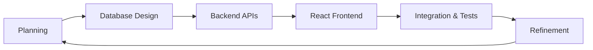
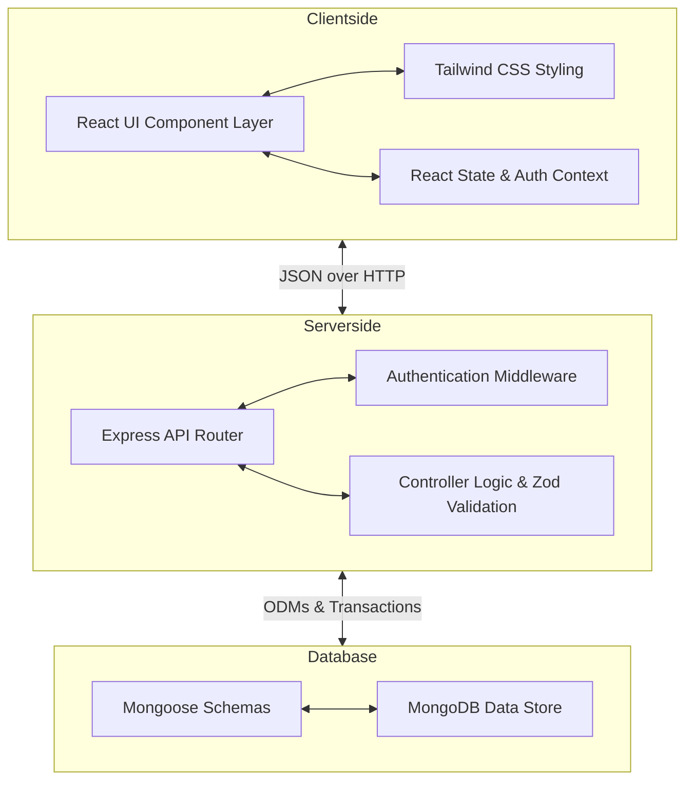
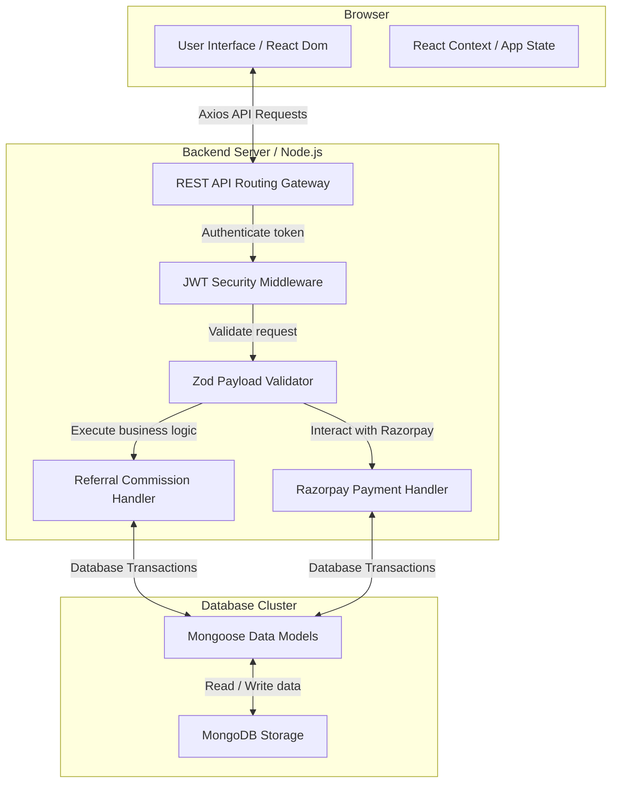
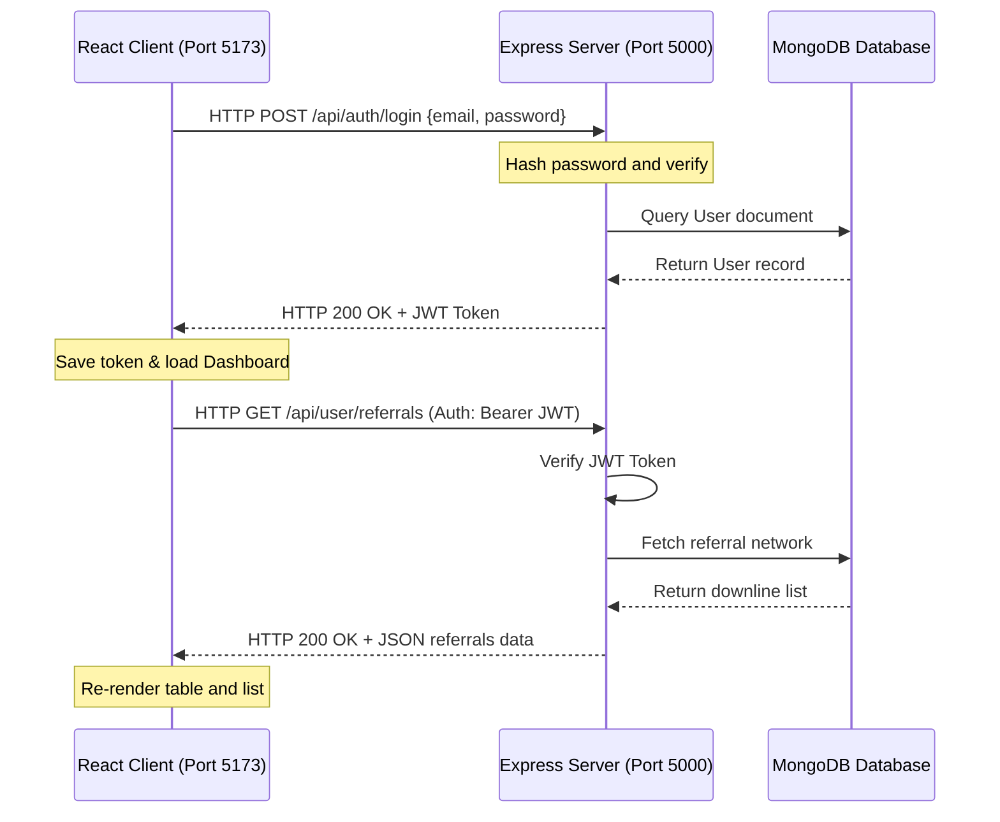
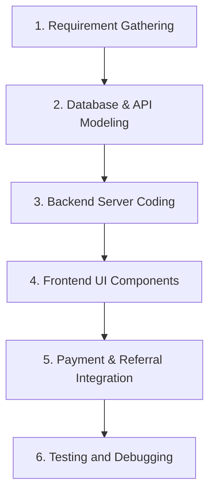
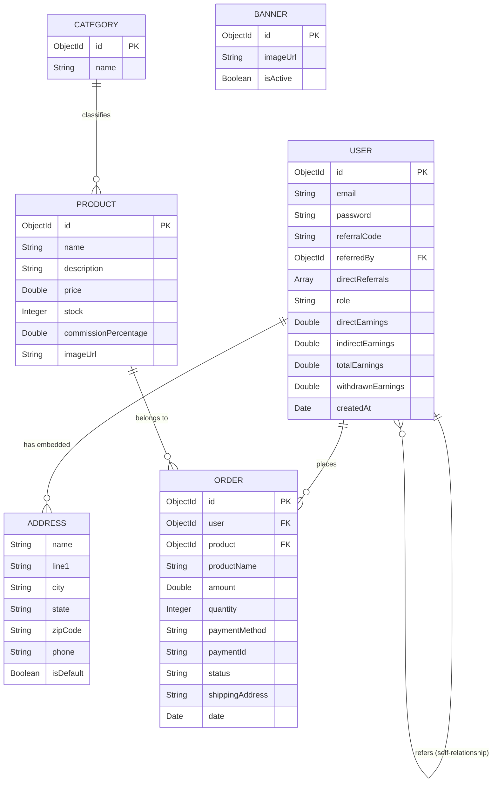
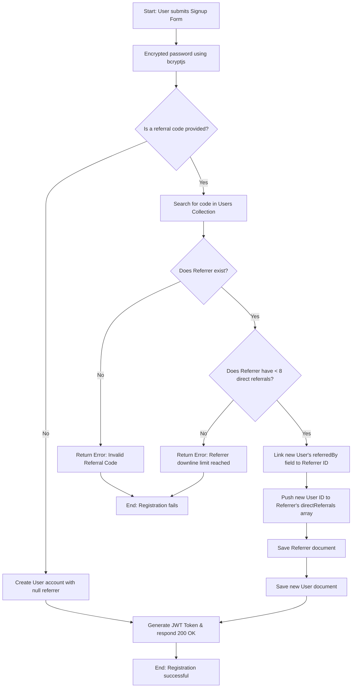
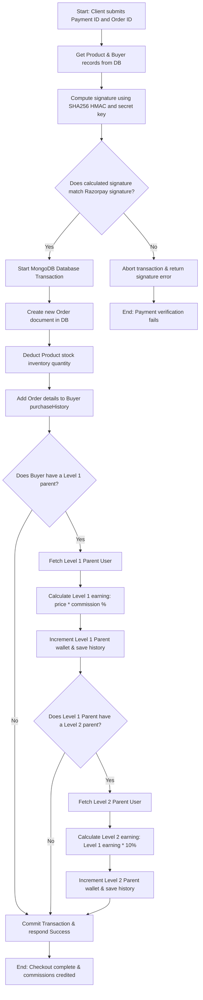

# CHAPTER – 2: METHODOLOGY

## 2.1 Background

In software engineering, a development methodology represents the structured framework of processes, models, and guidelines used to design, build, test, and maintain a software application. Without a well-planned methodology, developing complex web systems can become highly chaotic, leading to database errors, security flaws, and poor user experiences. This is especially true for systems that involve financial transactions and multi-level data tracking, such as the Referral E-Commerce System. Building an application that handles user shopping carts, online payment gateways, and a two-tier referral commission calculation requires a highly disciplined design and coding methodology to ensure that data remains consistent and transactions are executed securely.

For this project, an **Agile/Incremental Development Methodology** was selected. In a student project environment, building a large web application all at once can be overwhelming. The incremental model breaks the software development lifecycle into small, manageable stages or sprints. Each increment focus on building, testing, and integrating a specific module before moving on to the next one. This iterative approach is highly beneficial because it allows for continuous testing and debugging, ensuring that errors in basic functions are fixed before complex systems are built on top of them.

The development was divided into six key incremental stages:
1. **Requirements & Setup**: Setting up the project architecture, establishing Git repositories, and defining folders for the client and server.
2. **User Authentication Module**: Building the secure registration and login routes, implementing bcryptjs encryption, and setting up JSON Web Token (JWT) session generation on the server.
3. **Core Storefront & Cart**: Developing product database models, listing components, quantity selector logic, dynamic shopping carts, and address management.
4. **Razorpay Integration**: Integrating Razorpay payment interface and backend payment verification.
5. **Referral Wallet & Commission Engine**: Developing the mathematical referral calculation logic, handling level 1 and level 2 commissions, and wrapping them in atomic database transaction sessions.
6. **Admin Dashboard and Wallet Redemptions**: Implementing the administrative CRUD systems, platform transaction reports, and simulated voucher code generators for withdrawals.

This methodical, step-by-step approach ensured that every feature was validated and verified before adding subsequent modules, leading to a highly stable final system.

---

## 2.2 Project Description

The "Referral E-Commerce System" is a MERN-stack web application designed to demonstrate a modern online storefront integrated with a two-level referral marketing system. The application serves two main purposes: it provides a smooth, modern shopping experience for regular customers, and it operates an automated digital sales ledger that calculates, records, and distributes commissions to promoters in real-time.

At a high level, the system is composed of three interconnected architectural modules:

### 1. The Clientside React Interface
The frontend provides a rich, responsive interface where users can interact with the system. Users can browse the catalog of products, search for items, and filter them by category. They can add items to their shopping cart, select delivery addresses from their profile, and make secure purchases. Promoters have a private dashboard where they can see their unique referral code, copy an invitation link, view a list of their Level 1 and Level 2 referrals, track their wallet balance, and redeem their earnings for mock gift cards or buy products directly using wallet funds.

### 2. The Serverside Express API
The backend acts as the brains of the system, processing all API requests from the React client. It exposes endpoints for creating accounts, managing logins, executing shopping cart checkouts, and verifying payments. The backend ensures security by authenticating requests using JWT tokens and validating input data using Zod schema validators before executing any database queries. It also interfaces directly with the Razorpay API to create payment orders.

### 3. The MongoDB Database
MongoDB stores all system data in flexible document structures. Mongoose acts as the Object Data Modeling (ODM) layer on the server, defining clean schemas for users, addresses, products, orders, categories, and banners. The database handles complex relational data—such as user downline paths and earning history ledgers—efficiently, and utilizes database transactions to ensure that commission distributions are executed atomically and safely.

---

## 2.3 System Architecture

The overall system architecture is built on the **MERN (MongoDB, Express, React, Node.js)** framework. This framework is popular because it uses JavaScript across the entire stack, from frontend rendering to database scripting. This unified language structure makes it easy for developers to transfer data structures between client and server.

### Component Breakdown:

* **React.js (Frontend Layer)**: Renders dynamic views that update instantly without reloading the entire page. It uses React Router for client-side navigation. It implements a global React Context API (`AuthContext`) to maintain user authentication states, storing the user token locally and attaching it automatically to clientside API requests.
* **Tailwind CSS (Styling Layer)**: Provides responsive, mobile-first CSS styles directly inside HTML elements, ensuring that user dashboards, storefronts, and tables adjust dynamically to different screen dimensions.
* **Express.js (Routing Layer)**: Runs on top of Node.js to receive client HTTP requests, parse JSON payloads, and direct them to modular routers (`auth.js`, `shop.js`, `payment.js`, `admin.js`, `user.js`).
* **Node.js (Server Runtime Layer)**: Executes JavaScript code on the server. Its asynchronous, non-blocking input/output execution model is highly efficient, allowing it to handle many simultaneous API connections from active shoppers and promoters.
* **Mongoose & MongoDB (Database Layer)**: MongoDB stores system data in highly flexible JSON-like documents. Mongoose is a JavaScript framework that allows us to define schemas, validate field types (such as email formats, unique referral codes, and maximum arrays), and write complex queries. 

In this system architecture, the frontend client and the backend server are decoupled. The React frontend interacts with the Express backend solely by sending JSON payloads over HTTP requests, allowing the client and server to scale independently.

---

## 2.4 Client-Server Architecture

The Referral E-Commerce System operates on a stateless **Client-Server Architecture**. In this setup, the frontend user interface (client) and the database-processing backend (server) are separated. The client does not directly access the database, and the server does not handle page layout rendering. They communicate exclusively using REST (Representational State Transfer) API calls over HTTP.

### Communication Flow:
1. **Stateless REST APIs**: The React application runs in the user's browser, while the Express application runs on the server. When the client needs to fetch data (like the product list) or perform an action (like checkout), it sends an HTTP request (GET, POST, PUT, DELETE) containing JSON data.
2. **CORS (Cross-Origin Resource Sharing)**: Since the client and server are running on different ports or domains, the backend server implements CORS middleware. This middleware allows security-controlled communication, permitting the React app client to securely read headers and send request payloads.
3. **Session Management (Stateless JWT)**: Traditional web applications store user session data directly in server memory. This limits scalability. This project uses **JSON Web Tokens (JWT)** for stateless sessions. When a user logs in successfully, the server signs a payload containing the user's ID using a secure backend secret, and sends it back to the client. The client saves this token locally. For any future request to private routes (like checking out or viewing wallet balances), the client includes this token in the request header. The server verifies the token signature, authenticates the user, and processes the request.
4. **Data Exchange format**: All requests and responses are serialized in JSON (JavaScript Object Notation), which guarantees lightweight and high-speed data exchanges.

---

## 2.5 Design Methodology

To ensure that the Referral E-Commerce System was built cleanly, a structured **Software Development Life Cycle (SDLC)** approach was followed. The project went through six developmental phases, ensuring that requirements were gathered, database relationships were modeled, backend code was tested, and user interfaces were polished before final release.

### 1. Requirement Gathering and Analysis
In this initial stage, the functional and non-functional goals of the system were identified. The core requirements were defined: we needed an online catalog where users could purchase items, a secure checkout process, a two-level commission structure for referral payouts, and a maximum direct referral width of 8 active signups to prevent database overflow.

### 2. Database & API Modeling
The database structures were mapped out by drafting Mongoose schemas for users, products, orders, categories, and banners. The REST API routes were structured logically:
* `/api/auth` for signup and login paths.
* `/api/user` for profiles, addresses, and referral trees.
* `/api/shop` for products and categories.
* `/api/payment` for Razorpay orders and wallet checkouts.
* `/api/admin` for platform administration.

### 3. Backend Server Coding
The Express.js backend was developed with modular routing files, validation schemas using Zod, and encryption libraries like bcryptjs. In this phase, Mongoose transactions were introduced to wrap checkout operations, ensuring that stock counts and commission wallets update atomically without database errors.

### 4. Frontend UI Components
Using React, individual interface components were built, such as navigation bars, product cards, category filters, and address selection overlays. Tailwind CSS was applied to design custom, mobile-responsive layout blocks, dashboard grids, and typography structures.

### 5. Payment and Referral Integration
The React client was connected to the Razorpay SDK widget to open payment overlays. The Express backend was integrated with the official Razorpay SDK to create orders and verify transaction signatures using SHA256 HMAC cryptographic hashing. The two-tier referral logic was hooked into successful checkout callbacks.

### 6. Testing and Debugging
A testing phase was carried out to verify all calculations. Mock transactions were processed using dummy payment profiles, verifying that the Level 1 parent received the direct commission and the Level 2 parent received their 10% indirect share. The 8-referral cap was validated by trying to register 9 users under the same code, ensuring the system rejected the 9th registration as expected.

---

## 2.6 Data Flow Diagram (DFD)

A Data Flow Diagram (DFD) visually represents how data moves through a software system, showing the sources of information, the processes that modify data, and where the information is stored. 

### DFD Level 0 (Context Diagram)
The Context Diagram represents the entire Referral E-Commerce System as a single process, showing the direct interactions between the system and its external entities: the User, the Admin, and the Razorpay Gateway.

* **User Flows**: The user inputs credentials to log in, registers using a referral code, adds products to their cart, inputs delivery addresses, and receives order confirmations and wallet credits.
* **Admin Flows**: The admin inputs new product profiles and active promotional banners, receiving live platform sales logs and system-wide order summaries.
* **Razorpay Flows**: The system submits order details (amount, currency) and receives cryptographic payment confirmations.

---

### DFD Level 1 (Process Breakdown Diagram)
The DFD Level 1 diagram breaks the main system process into its four core sub-processes, showing how data interacts with specific database storage tables (collections):

* **Process 1.0 (Auth)**: Handles signup/login, validates referral codes, and registers users into the **Users Collection**.
* **Process 2.0 (Cart)**: Allows users to search and add items, checking active item quantities in the **Products Collection**.
* **Process 3.0 (Checkout)**: Integrates with Razorpay to verify signatures, saves records to the **Orders Collection**, reduces product stock in the **Products Collection**, and distributes commissions across parent nodes in the **Users Collection**.
* **Process 4.0 (Admin)**: Provides tools for admins to update catalog lists and view platform reports from all database collections.

---

## 2.7 ER Diagram

The Entity-Relationship (ER) Diagram defines the structural entities inside our MongoDB database, their respective attributes (fields), and how they relate to one another.

### Key Relationships explained:
1. **User and Address (One-to-Many Embedded)**: Every User document contains an array of `addresses` sub-documents. This embedded structure is efficient because a user's addresses are retrieved instantly alongside their main profile data.
2. **User and Order (One-to-Many)**: A single User can place multiple Orders over time. The `Order` entity stores a foreign key referencing the `User` ID.
3. **User Self-Referential Relationship (One-to-Many)**: A user's profile can store a `referredBy` field that holds the MongoDB ObjectId of another User (their Level 1 Parent). This recursive relationship is what forms the nested referral downline tree.
4. **Product and Order (One-to-Many)**: A Product can be purchased across different orders. The `Order` entity stores the `productId` as a reference alongside the purchase amount and quantity.
5. **Category and Product (Many-to-One)**: Products are classified into specific Categories, allowing user storefronts to filter items dynamically.

---

## 2.8 Flowcharts

Flowcharts represent the step-by-step operational workflows and logical algorithms that execute inside our application. Two major processes demonstrate the complex business logic of our Referral E-Commerce System:

### 1. User Sign Up and Referral Binding Flowchart
This flowchart explains the step-by-step validation that runs when a new user registers on the website:

---

### 2. Payment Verification and Commission Payout Flowchart
This flowchart maps out the backend transaction logic that runs when a user completes a checkout payment:

This clear, logical layout ensures that the calculation of direct and indirect rewards is executed safely and cleanly, preventing database anomalies and ensuring system stability.
