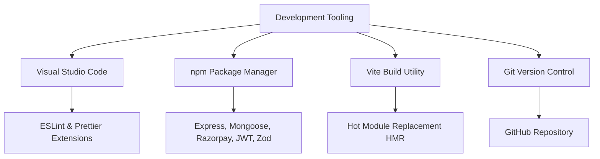

# CHAPTER – 3: HARDWARE AND SOFTWARE REQUIREMENTS

To build, test, and run the **Referral E-Commerce System** successfully, specific hardware and software configurations are required. Since this is a modern web application based on the MERN stack, the requirements are split into two categories: the development side (used by the student/developer to build and host the system) and the client side (used by the end-user or shopper to access the website). 

This chapter details the minimum and recommended hardware configurations, software dependencies, development tools, and browser compatibility rules for the application.

---

## 3.1 Hardware Requirements

The MERN stack is highly efficient because it does not require expensive, heavy hardware for development or execution. The local servers run efficiently on standard consumer laptops or computers. Below are the hardware configurations used to develop and test the application, alongside the requirements for the end-user.

### 1. Developer / Development hardware
These are the hardware specifications of the machine used to write the code, run the local React development server, execute the Node.js API server, and host the local database instance simultaneously:

| Hardware Component | Minimum Requirement | Recommended Specification |
| :--- | :--- | :--- |
| **Processor (CPU)** | Intel Core i3 (4th Gen) or AMD Ryzen 3 | Intel Core i5 / Apple Silicon (M1/M2/M3) |
| **System Memory (RAM)** | 8 GB DDR4 | 16 GB DDR4 / DDR5 (for smooth multitasking) |
| **Storage (SSD/HDD)** | 20 GB free space on HDD | 50 GB free space on SSD (for fast load times) |
| **Graphics (GPU)** | Integrated Intel / AMD Graphics | Integrated or Dedicated GPU |
| **Display Monitor** | 1366 x 768 Resolution Screen | 1920 x 1080 Full HD Monitor |
| **Input Devices** | Standard Keyboard and Mouse | Ergonomic Keyboard and Optical Mouse |

*Note: An SSD (Solid State Drive) is highly recommended over a traditional HDD because it significantly speeds up code compilation times in Vite, database reads in MongoDB, and the loading of package libraries.*

### 2. Actual Development Machine Specifications
For this project's implementation, the development and verification were conducted locally on an actual hardware setup with the following specifications:
* **System Model**: Apple MacBook Air
* **Processor (CPU)**: Apple M4 Chip (8-Core CPU and 10-Core GPU)
* **System Memory**: 16 GB Unified RAM
* **System Storage**: 256 GB Solid State Drive (SSD)
* **Operating System**: macOS Sequoia (Version 15.x, Apple Silicon arm64 architecture)
* **Primary Sandbox Browser**: Google Chrome - Version 148.0.7778.168 (Official Build) (arm64)

### 3. Client / End-User Hardware
These are the basic hardware specifications required for a consumer, promoter, or shopper to load and use the application smoothly on their personal devices:

* **Desktop Laptops and Computers**:
  * **Processor**: Intel Dual-Core or newer processor.
  * **RAM**: 4 GB RAM minimum.
  * **Network**: An active Internet connection (minimum 2 Mbps speed for payment gateways to load overlays without timeout errors).
* **Mobile Devices (Smartphones and Tablets)**:
  * **Processor**: Standard Quad-core or Octa-core mobile processor.
  * **RAM**: 2 GB RAM minimum.
  * **Network**: Active 4G, 5G, or Wi-Fi network connectivity.

---

## 3.2 Software Requirements

The software environment forms the core foundation of the Referral E-Commerce System. Since the project uses the MERN stack, the entire backend API and frontend views are driven by JavaScript, reducing the number of external software installations required.

### 1. Development Software Environment
Below is the list of software environments, runtimes, and databases installed on the developer's system:

* **Operating System**: macOS (Sonoma/Sequoia), Windows 10/11 (64-bit), or Ubuntu Linux. The development environment is cross-platform, meaning the code runs identically across all major operating systems.
* **JavaScript Runtime**: **Node.js (v18.x or v20.x LTS)**. Node.js is necessary to run serverside JavaScript, manage package installations, and compile the React frontend.
* **Database Management System**: **MongoDB Community Edition (v6.x or newer)**. Used as the local NoSQL document database. Alternatively, **MongoDB Atlas** (a cloud database) is utilized to host database structures securely in the cloud.
* **Web Styling Tools**: **Tailwind CSS (v3.x)** and **PostCSS** for compiling responsive, utility-first CSS utility designs.
* **API Testing Tool**: **Postman** or **VS Code Thunder Client**. Used to trigger mock POST and GET requests to test authentication and payment endpoints before building the frontend interface.

### 2. Deployment Software Environment
For hosting the prototype system on the cloud, the following software hosts are used:

* **Frontend Hosting Platform**: **Vercel** or **Netlify**. These systems host the static React frontend, deploying optimized assets directly to edge servers.
* **Backend API Hosting Platform**: **Render** or **Railway**. These cloud servers run the active Node.js server instance, keeping the API endpoints online.
* **Payment Processing Integration**: **Razorpay Sandbox API**. Used to simulate Indian Rupee (INR) transactions without using real currency during testing.

---

## 3.3 Development Environment

The development environment consists of the specific text editors, build tools, package utilities, and packages used to write and organize the application code.

### 1. Integrated Development Environment (IDE)
**Visual Studio Code (VS Code)** was selected as the primary text editor. It is lightweight, fast, and provides helpful developer extensions:
* **Prettier**: Automatically formats JavaScript and CSS files for clean code alignment.
* **ESLint**: Displays code syntax errors and warnings in real-time, helping developers catch bugs before running the code.
* **Tailwind CSS IntelliSense**: Auto-completes style utilities directly in React elements, speeding up UI design.

### 2. Node Package Manager (npm)
Every package dependency in this project is managed using **npm** (included with Node.js). The libraries are split into frontend and backend dependencies:

* **Backend Libraries (`package.json` in Server)**:
  * `express`: High-performance HTTP server routing framework.
  * `mongoose`: Object Data Modeling (ODM) framework used to write schemas and queries for MongoDB.
  * `bcryptjs`: Secure hashing tool to encrypt user passwords.
  * `jsonwebtoken (JWT)`: Creates secure session tokens for user authentication.
  * `razorpay`: Official software development kit (SDK) to connect to the Razorpay checkout APIs.
  * `zod`: Data schema validation library used to verify incoming API request bodies.
  * `cors`: Middleware to allow cross-origin requests between the React client and Express API.
  * `dotenv`: Manages environment variables (like API keys and database links) securely.

* **Frontend Libraries (`package.json` in Client)**:
  * `react` & `react-dom`: The core component rendering framework.
  * `react-router-dom`: Handles client-side navigation and routes without page reloads.
  * `axios`: Promise-based HTTP client to send GET and POST requests to the Express server.
  * `lucide-react`: A clean collection of modern vector icons used throughout the dashboard layouts.

### 3. Build & Compiler Utility
The React frontend uses **Vite** as its build utility instead of the older Create React App (CRA). Vite is exceptionally fast, utilizing Hot Module Replacement (HMR) to update browser views instantly when a file is saved, making frontend development faster.

### 4. Version Control System
**Git** was used locally to track changes, create backup commits, and manage developmental branches. The repository was pushed to **GitHub**, providing cloud backup and code sync tools.

---

## 3.4 Browser Compatibility

Since the Referral E-Commerce System is designed as a web application, it must run correctly on different web browsers without layout breaks or functional errors. The application utilizes modern web standards: **HTML5** for page structure, **CSS3 (Flexbox/Grid)** for responsive styling, and **JavaScript (ES6+)** for asynchronous API communications.

Most modern web browsers are built on similar rendering engines (such as Chromium for Chrome, Edge, and Opera, or WebKit for Safari), which guarantees consistent layout rendering.

Below is the browser compatibility matrix tested for the application:

| Web Browser | Engine | Minimum Compatible Version | Status |
| :--- | :--- | :--- | :--- |
| **Google Chrome** | Blink / Chromium | Version 90+ | Fully Compatible |
| **Mozilla Firefox** | Gecko | Version 88+ | Fully Compatible |
| **Microsoft Edge** | Blink / Chromium | Version 90+ | Fully Compatible |
| **Apple Safari** | WebKit | Version 14+ | Fully Compatible |
| **Opera** | Blink / Chromium | Version 76+ | Fully Compatible |
| **Mobile Browsers** | Chrome Mobile / Safari iOS | iOS 14+ / Android 9+ | Fully Compatible (Responsive Layout) |

### Key Browser Technologies Required:
1. **JavaScript Support**: The browser must have JavaScript enabled, as React relies entirely on clientside rendering to construct elements and manage local state.
2. **Local Web Storage (`localStorage`)**: The browser must support local storage APIs, as the application stores the user's JWT authorization token locally to keep them logged in during subsequent browser sessions.
3. **Secure Sockets Layer (SSL/TLS)**: To process payment checkouts via the Razorpay SDK, the browser must support modern secure socket layers to encrypt transaction handshakes securely.
