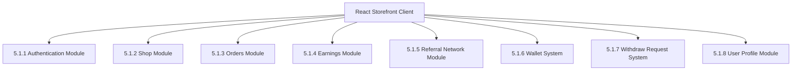
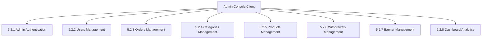
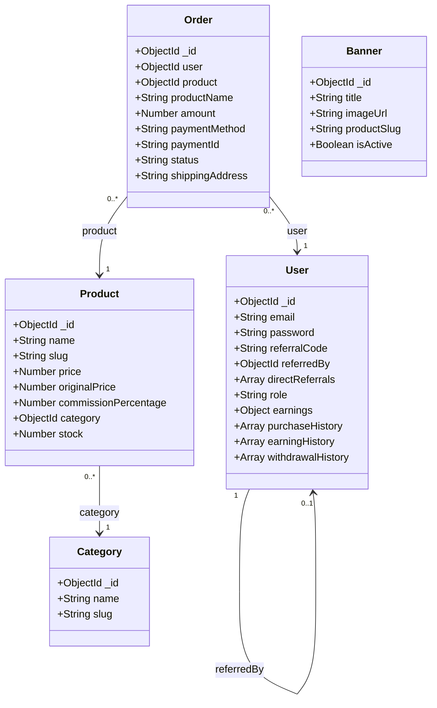
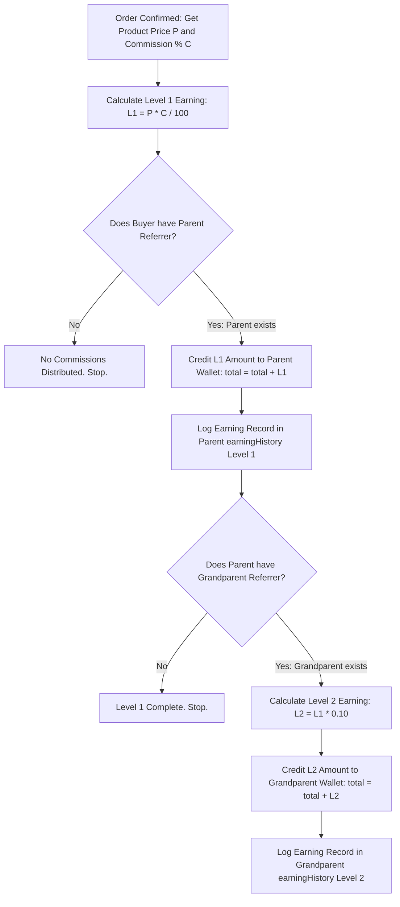
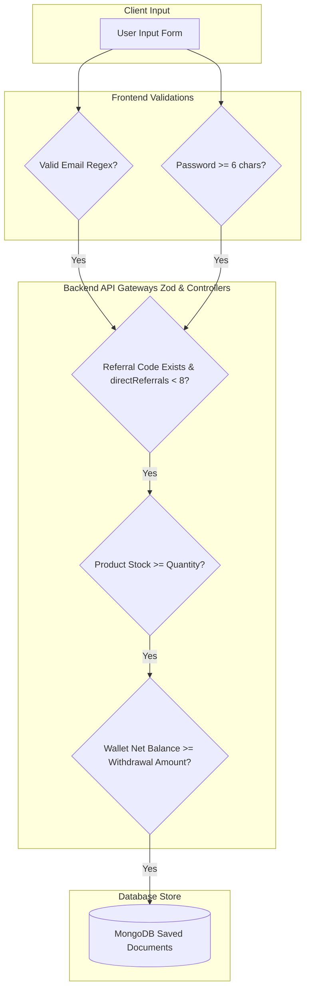

# CHAPTER 5 – SYSTEM IMPLEMENTATION

This chapter details the architectural implementation of the **Referral E-Commerce System**. System implementation is the phase where the theoretical designs, logic flows, and technology selections are translated into operational software. 

The application is structured as a decoupled client-server platform. The frontend consists of a modular React.js single-page application built on Vite and Tailwind CSS. The backend consists of an asynchronous Node.js server running Express.js routing, secured by JSON Web Token (JWT) middlewares, interacting with a document-based MongoDB instance via Mongoose.

Below is a comprehensive breakdown of the client-side modules, server-side admin functions, database collections, and API development configurations that implement this system.

---

## 5.1 User Side Modules

The user side of the application is a fully responsive storefront, dashboard, and promotion management console. It is built as a single-page application (SPA), enabling smooth page changes without hard browser reloads. Shared states (such as authentication status and active shopping carts) are synchronized using React Context APIs.



### 5.1.1 Authentication Module
The Authentication Module manages user registration (`Signup.jsx`) and login (`Login.jsx`) sessions.
* **Core Purpose**: Captures the user's email, password, phone, and optional referral code. When a user submits their credentials, the module sends an API request to the backend server. Upon successful credentials check, it saves the returned JWT token to browser `localStorage` and updates the React application state to mark the user as logged in.
* **Referral Interception**: During registration, if a referral code is present in the input fields, the module sends the code to the backend to verify its validity, ensuring new signups can link dynamically to their parent referrers.
* **State Management**: Uses state variables like `email`, `password`, `errorMsg`, and `loading` to manage input binding, error message banners, and form-submitting states dynamically.

### 5.1.2 Shop Module
The Shop Module implements the retail catalog storefront (`Dashboard.jsx`, `ProductDetail.jsx`).
* **Key Operations**: Displays categories and promotional banners fetched from the server. Users can search for products, filter by category tabs, and browse product cards.
* **Component Details**: Each product card displays the product name, price, strike-through original price (if on sale), active stock counts, and the **commission percentage** offered to referrers.
* **Navigation**: Clicking on a product card uses React Router to open the detailed product view, displaying description summaries, stock availability levels, and action buttons to "Add to Cart" or "Buy Now".

### 5.1.3 Orders Module
The Orders Module handles the cart checkout process and tracks purchase logs (`Cart.jsx`, `MyPurchases.jsx`).
* **Core Responsibilities**: Displays items added to the cart, lets users modify quantities, calculates cart subtotals, and lists shipping addresses.
* **Checkout Flow**: To finalize checkout, users select a delivery address and a payment method:
  1. **Razorpay Checkout**: Opens the secure Razorpay payment gateway overlay.
  2. **Wallet Checkout**: Pays using net wallet credit.
* **Order Status Ledger**: In `MyPurchases.jsx`, users view chronological lists of their orders, displaying the purchased items, quantities, total spent, transaction IDs, payment methods, and current shipping status (e.g. Confirmed, Delivering, Delivered).

### 5.1.4 Earnings Module
The Earnings Module serves as the promoter's financial dashboard (`Earnings.jsx`).
* **Primary Purpose**: Displays key financial metrics in clean grid-styled containers:
  * **Direct Earnings (Level 1)**: Commission earned from direct referrals.
  * **Indirect Earnings (Level 2)**: Commission earned from direct referrals' referrals.
  * **Total Accumulated Earnings**: All historical credit earnings.
  * **Withdrawn Balance**: Cumulative value of funds already redeemed.
* **Transactional Ledger**: Renders a tables list (`earningHistory`) that logs every individual credit: showing the exact commission amount, the buyer's email, the product purchased, the referral tier level (1 or 2), and the transaction timestamp.

### 5.1.5 Referral Network Module
The Referral Network Module tracks and displays the user's promotion tree (`Referrals.jsx`).
* **Key Features**: Generates the user's custom, shareable referral sign-up link (e.g. `http://localhost:5173/signup?ref=ABC123D`). It provides an easy copy button that saves the link to the client clipboard.
* **Downline Counter & Tree Structure**: Displays details of their direct parent referrer (if they registered using a referral link) and renders a visual grid showing their registered downlines. The system displays a counter indicating active direct referrals, helping users verify their downline width against the maximum system cap of 8.

### 5.1.6 Wallet System
The Wallet System represents the virtual digital ledger on the frontend (`Earnings.jsx`, `RedeemModal.jsx`).
* **Operational Mechanics**: Displays the dynamic **Net Wallet Balance**, calculated using the system logic:
  $$\text{Net Balance} = \text{Total Accumulated Earnings} - \text{Withdrawn Balance}$$
* **Checkout Integration**: Integrates directly into the cart payment overlays, enabling promoters to buy products using their net earnings. The system verifies in real-time if the net balance exceeds the order subtotal, toggling the "Pay via Wallet" option only when funds are sufficient.

### 5.1.7 Withdraw Request System
The Withdraw Request System manages the redemption of wallet balances into retail vouchers (`RedeemModal.jsx`).
* **Primary Features**: Opens a modal showing choices to withdraw funds. Since real bank account wire processing requires extensive compliance, the system simulates brand gift voucher redemptions.
* **Voucher Generation**: Users input a withdrawal amount and choose a retail brand (e.g. Amazon, Flipkart). The system verifies that the net balance is sufficient, submits the request, and instantly displays a randomly generated, secure coupon code.
* **Historical Ledger**: Renders a history log inside `withdrawalHistory` displaying the brand name, date of redemption, withdrawn amount, and the coupon code for user reference.

### 5.1.8 User Profile Module
The User Profile Module lets users manage their credentials and delivery books (`Profile.jsx`).
* **Core Responsibilities**: Displays user account information, registration date, and provides tools to edit profile phone numbers and dynamic addresses.
* **Delivery Address Book**: Allows users to save multiple shipping address cards (such as "Home" or "Office"). Users can add new addresses, edit existing details, delete unused address cards, and check a radio option to designate a default delivery address, which loads automatically during cart checkout.

---

## 5.2 Admin Side Modules

The Admin Side of the application is a secure administrative management console (`AdminDashboard.jsx`, `AdminSidebar.jsx`). It is accessible only to users whose database records contain the specific role credential `role: 'admin'`.



### 5.2.1 Admin Authentication
The Admin Authentication module protects administrative routes from unauthorized access.
* **Access Control Purpose**: When the admin console attempts to load, the frontend intercepts the JWT token in `localStorage`. The backend routes decode the token payload and check if the role claim equals `admin`. If the claim matches, access is allowed. If a standard customer attempts to access the URL, the server rejects the request with an HTTP status `403 Forbidden`, and the client-side router redirects the user back to the homepage.

### 5.2.2 Users Management
The Users Management module provides a directory of registered users (`AdminDashboard.jsx`).
* **Core Features**: Renders a comprehensive list of all platform accounts. Administrators can search for specific users by email and view registration timestamps.
* **Promotional Tracking**: Displays user details including their unique referral code, the ID of the parent who referred them, their active direct downlines count, and their complete wallet ledger (Total, Withdrawn, and Net Balance), helping administrators monitor platform performance and detect referral fraud.

### 5.2.3 Orders Management
The Orders Management module provides control over global retail operations.
* **Key Responsibilities**: Displays every order placed on the platform. The table details the order date, the buyer's email, the product name, payment method (Razorpay or Wallet), total value, transaction ID, and the shipping address.
* **Status Updates**: Provides a dropdown interface that allows administrators to update the shipping state of an order: updating it from `Confirmed` to `Processing`, `Delivering`, and finally `Delivered`, keeping users updated in real-time.

### 5.2.4 Categories Management
The Categories Management module organizes the product catalog structure.
* **Primary Purpose**: Displays all active product departments. Administrators can create new categories by typing a category name.
* **Dynamic Slugs**: The system automatically generates a unique, URL-safe slug for each category (e.g. "Smart Devices" becomes `smart-devices`). Administrators can also delete categories, which removes them from the user storefront filter bar.

### 5.2.5 Products Management
The Products Management module controls the e-commerce inventory and referral rates.
* **Key Operations**: Displays all retail items. It provides a detailed modal form to create, update, or delete products.
* **Product Details**: Captures product name, category linkage, image URLs, description text, stock availability, original cross-out retail price, and the current selling price.
* **Commission Cap Rules**: Allows administrators to specify a custom **commission percentage** (between 1% and 50%) for each individual product. This controls the level 1 and level 2 commissions distributed dynamically upon sales checkout.

### 5.2.6 Withdrawals Management
The Withdrawals Management module oversees simulated payout activities.
* **Core Responsibilities**: Displays a global history log of every digital gift card redemption requested across the platform. The ledger shows the date of request, the user's email, the brand selected (Amazon / Flipkart), the coupon code generated, and the amount redeemed. This allows administrators to audit and reconcile total virtual payout liabilities against platform revenues.

### 5.2.7 Banner Management
The Banner Management module controls the homepage visuals.
* **Primary Features**: Allows administrators to configure dynamic carousel marketing banners. Banners require a title, description, image URL, and a target product slug.
* **Active Status**: Administrators can toggle a banner's active status. Active banners render automatically on the user homepage dashboard, driving storefront traffic to designated sale products.

### 5.2.8 Dashboard Analytics
The Dashboard Analytics module provides a high-level summary of platform performance.
* **Operational Mechanics**: Renders key performance indicators in an analytics grid:
  * **Total Registered Users**: Count of all customer accounts.
  * **Total Store Orders**: Count of all purchases.
  * **Total Platform Revenue**: Cumulative sum of all successful transactions.
  * **Distributed Commissions**: Cumulative sum of all level 1 and level 2 commissions credited.

---

## 5.3 Database Implementation

The database is built on **MongoDB**, using **Mongoose ODM** to define schemas, structure schemas rules, and enforce validations. Below is the actual schema definition for each collection, matching your database implementation.



### 5.3.1 User Collection (`User.js`)
The `User` collection stores user account details, shipping addresses, two-tier referral trees, earnings balances, historical credits, and withdrawal coupon history.

```javascript
const mongoose = require('mongoose');

const UserSchema = new mongoose.Schema({
    email: { type: String, required: true, unique: true },
    password: { type: String, required: true },
    addresses: [{
        name: { type: String, required: true }, // e.g., "Home", "Office"
        line1: { type: String, required: true },
        city: { type: String, required: true },
        state: { type: String, required: true },
        zipCode: { type: String, required: true },
        phone: { type: String, required: true },
        isDefault: { type: Boolean, default: false }
    }],
    referralCode: { type: String, unique: true },
    referredBy: { type: mongoose.Schema.Types.ObjectId, ref: 'User', default: null },
    directReferrals: {
        type: [{ type: mongoose.Schema.Types.ObjectId, ref: 'User' }],
        validate: {
            validator: function (val) {
                return val.length <= 8; // Enforce maximum downline width of 8
            },
            message: 'Maximum of 8 direct referrals allowed.'
        }
    },
    role: { type: String, enum: ['user', 'admin'], default: 'user' },
    earnings: {
        direct: { type: Number, default: 0 },
        indirect: { type: Number, default: 0 },
        total: { type: Number, default: 0 },
        withdrawn: { type: Number, default: 0 }
    },
    purchaseHistory: [{
        productId: { type: mongoose.Schema.Types.ObjectId, ref: 'Product' },
        productName: String,
        productImage: String,
        price: Number,
        razorpayOrderId: String,
        razorpayPaymentId: String,
        voucherCode: String,
        status: { type: String, default: 'Payment Successful' },
        date: { type: Date, default: Date.now }
    }],
    earningHistory: [{
        amount: Number,
        fromUser: { type: mongoose.Schema.Types.ObjectId, ref: 'User' },
        fromUserEmail: String,
        productName: String,
        level: { type: Number, enum: [1, 2] },
        date: { type: Date, default: Date.now }
    }],
    withdrawalHistory: [{
        amount: Number,
        couponCode: String,
        brand: String,
        date: { type: Date, default: Date.now }
    }],
    createdAt: { type: Date, default: Date.now }
}, { timestamps: true });

module.exports = mongoose.model('User', UserSchema);
```

### 5.3.2 Product Collection (`Product.js`)
The `Product` collection manages retail items, listing prices, categories, and referral commission structures.

```javascript
const mongoose = require('mongoose');

const ProductSchema = new mongoose.Schema({
    name: { type: String, required: true },
    slug: { type: String, unique: true, sparse: true },
    price: { type: Number, required: true },
    originalPrice: { type: Number },
    commissionPercentage: { type: Number, required: true, default: 10, min: 1, max: 50 },
    description: { type: String },
    imageUrl: { type: String },
    category: { type: mongoose.Schema.Types.ObjectId, ref: 'Category' },
    stock: { type: Number, default: 0 }
}, { timestamps: true });

module.exports = mongoose.model('Product', ProductSchema);
```

### 5.3.3 Orders Collection (`Order.js`)
The `Order` collection stores customer purchases, detailing transaction metrics and fulfillment statuses.

```javascript
const mongoose = require('mongoose');

const OrderSchema = new mongoose.Schema({
    user: { 
        type: mongoose.Schema.Types.ObjectId, 
        ref: 'User', 
        required: true 
    },
    product: { 
        type: mongoose.Schema.Types.ObjectId, 
        ref: 'Product', 
        required: true 
    },
    productName: { type: String, required: true },
    productImage: { type: String },
    amount: { type: Number, required: true },
    quantity: { type: Number, default: 1 },
    paymentMethod: { 
        type: String, 
        enum: ['Razorpay', 'Wallet'], 
        required: true 
    },
    paymentId: { type: String }, 
    razorpayOrderId: { type: String },
    status: { 
        type: String, 
        enum: ['Confirmed', 'Processing', 'Delivering', 'Delivered'], 
        default: 'Confirmed' 
    },
    shippingAddress: { type: String, required: true },
    phoneNumber: { type: String, required: true },
    createdAt: { type: Date, default: Date.now }
}, { timestamps: true });

module.exports = mongoose.model('Order', OrderSchema);
```

### 5.3.4 Withdraw Embedded Schema (Sub-Schema in `User.js`)
In e-commerce databases, withdrawals are often stored in a separate collection. In this project, they are implemented as an **Embedded Sub-Schema** (`withdrawalHistory`) within the main `User` collection.
* **Architectural Rationale**: Storing withdrawal history inside the `User` document is a NoSQL best practice that offers key advantages:
  1. **High Read Performance**: When a user loads their dashboard, the server fetches their profile and withdrawal logs in a single database query. This avoids complex SQL joins or multi-collection NoSQL queries.
  2. **Atomic Consistency**: Wallet balance deductions and voucher generation occur inside a single Mongoose update operation. The transaction succeeds or rolls back in one atomic action, preventing sync errors.
  3. **Schema Schema**:
     ```javascript
     withdrawalHistory: [{
         amount: Number,
         couponCode: String,
         brand: String,
         date: { type: Date, default: Date.now }
     }]
     ```

### 5.3.5 Banner Collection (`Banner.js`)
The `Banner` collection stores dynamic carousel assets displayed on the store homepage.

```javascript
const mongoose = require('mongoose');

const BannerSchema = new mongoose.Schema({
    title: {
        type: String,
        required: true
    },
    description: {
        type: String
    },
    imageUrl: {
        type: String,
        required: true
    },
    productSlug: {
        type: String 
    },
    isActive: {
        type: Boolean,
        default: true
    },
    createdAt: {
        type: Date,
        default: Date.now
    }
});

module.exports = mongoose.model('Banner', BannerSchema);
```

### 5.3.6 Category Collection (`Category.js`)
The `Category` collection categorizes products for clean browsing.

```javascript
const mongoose = require('mongoose');

const CategorySchema = new mongoose.Schema({
    name: { type: String, required: true },
    slug: { type: String, unique: true, required: true }
}, { timestamps: true });

module.exports = mongoose.model('Category', CategorySchema);
```

---

## 5.4 API Development

The backend routing architecture is organized into REST endpoints. Every private route is protected by a JSON Web Token (JWT) verification middleware (`auth.js`), while administrative routes are protected by a combined authentication and role-checking middleware (`admin.js`).

```
Client Request -> HTTP Method -> auth middleware -> controller -> DB updates -> JSON Response
```

### 5.4.1 Authentication APIs
These endpoints handle registration, login sessions, profile updates, and shipping address cards.

| HTTP Method | API URL Endpoint | Authorization | Request Body Payload | Database Logic / Operations | Success Response JSON |
| :--- | :--- | :--- | :--- | :--- | :--- |
| **POST** | `/api/auth/signup` | Public | `{ email, password, phone, address, referralCode }` | Validates input with Zod schemas. Verifies that the email is unique. Checks if a referral code is present: verifies the code exists, confirms the parent has fewer than 8 direct referrals, generates a unique code for the user, hashes the password using bcryptjs, saves the user record, and pushes their ID into the parent's `directReferrals` array. | `200 OK`<br>`{ token, user: { id, email, referralCode } }` |
| **POST** | `/api/auth/login` | Public | `{ email, password }` | Finds the user by email in MongoDB. Uses bcryptjs to compare the submitted password against the saved hash. If valid, signs a JWT token containing the user's ID. | `200 OK`<br>`{ token, user: { id, email, referralCode } }` |
| **GET** | `/api/auth/user` | Authenticated | None | Uses the JWT middleware to extract the `req.user.id` value, fetches the user's profile from the database, and strips the password hash before sending the response. | `200 OK`<br>`{ _id, email, referralCode, role, earnings: {...} }` |
| **PUT** | `/api/auth/profile` | Authenticated | `{ phone, address }` | Dynamically updates the authenticated user's contact information using Mongoose `$set` modifiers. | `200 OK`<br>`{ _id, email, phone, addresses: [...] }` |

### 5.4.2 Product & Shop APIs
These endpoints provide public access to categories, homepage banners, catalog searches, and product details.

| HTTP Method | API URL Endpoint | Authorization | Query Parameters | Database Logic / Operations | Success Response JSON |
| :--- | :--- | :--- | :--- | :--- | :--- |
| **GET** | `/api/shop/banners` | Public | None | Queries the `Banner` collection to retrieve all active banner advertisements (`isActive: true`). | `200 OK`<br>`[ { _id, title, imageUrl, productSlug } ]` |
| **GET** | `/api/shop/categories` | Public | None | Queries the `Category` collection to return all product departments, sorted alphabetically. | `200 OK`<br>`[ { _id, name, slug } ]` |
| **GET** | `/api/shop/products` | Public | `category`, `search`, `page` | Fetches products matching search criteria or category filters. Supports pagination to control load times. | `200 OK`<br>`{ products: [...], totalPages: 4, currentPage: 1 }` |
| **GET** | `/api/shop/products/:id` | Public | None (Route Parameter) | Finds a product in MongoDB by its ObjectId, populating category details. | `200 OK`<br>`{ _id, name, price, stock, commissionPercentage }` |

### 5.4.3 Order APIs
These endpoints manage e-commerce checkout flows, stock counts, and user purchase histories.

| HTTP Method | API URL Endpoint | Authorization | Request Body Payload | Database Logic / Operations | Success Response JSON |
| :--- | :--- | :--- | :--- | :--- | :--- |
| **POST** | `/api/payment/create-order` | Authenticated | `{ productId, addressId }` | Fetches product price from MongoDB, confirms stock is available, and securely calls the Razorpay API to generate a checkout order with the correct amount. | `200 OK`<br>`{ orderId, amount, currency }` |
| **POST** | `/api/payment/verify` | Authenticated | `{ razorpay_payment_id, razorpay_order_id, razorpay_signature, productId, addressId }` | **Two-Tier Commission Transaction Loop**:<br>1. Uses the private `RAZORPAY_KEY_SECRET` to verify payment integrity.<br>2. Deducts 1 item from product stock.<br>3. Calculates direct Level 1 commission ($P \times \text{comm}\% / 100$) and indirect Level 2 commission ($L1 \times 10\%$).<br>4. Credits Level 1 Parent's wallet and updates their `earningHistory`. If a Level 2 parent exists, credits their wallet.<br>5. Adds the purchase to the buyer's `purchaseHistory` and saves a record in the `Order` collection. | `200 OK`<br>`{ success: true, order: {...} }` |
| **POST** | `/api/payment/create-cart-order` | Authenticated | `{ cartItems, addressId }` | Iterates through cart items to calculate the total price, verifies inventory stock, and calls Razorpay to generate a combined order ID. | `200 OK`<br>`{ orderId, amount }` |
| **POST** | `/api/payment/verify-cart` | Authenticated | `{ paymentId, orderId, signature, cartItems, addressId }` | Validates Razorpay signature. Iterates through all cart items, deducts stock, calculates and distributes two-tier commissions for each product, and saves order records. | `200 OK`<br>`{ success: true }` |
| **GET** | `/api/shop/my-orders` | Authenticated | None | Queries the `Order` collection for orders matching the authenticated user's ID, sorted chronologically. | `200 OK`<br>`[ { _id, productName, amount, paymentMethod, status } ]` |

### 5.4.4 Wallet & Withdrawal APIs
These endpoints handle direct wallet payments and digital gift voucher redemptions.

| HTTP Method | API URL Endpoint | Authorization | Request Body Payload | Database Logic / Operations | Success Response JSON |
| :--- | :--- | :--- | :--- | :--- | :--- |
| **POST** | `/api/payment/pay-with-wallet` | Authenticated | `{ productId, addressId }` | **Mongoose Session Transaction**:<br>1. Verifies that product stock is available.<br>2. Verifies the buyer's net balance is sufficient ($Total - Withdrawn \ge Price$).<br>3. Increments user's `withdrawn` balance by the product price.<br>4. Deducts 1 item from product inventory.<br>5. Distributes two-tier commissions to referrers.<br>6. Logs the purchase to `purchaseHistory` and saves an `Order` document. | `200 OK`<br>`{ success: true, msg: 'Order placed using wallet' }` |
| **POST** | `/api/payment/withdraw` | Authenticated | `{ amount, brand }` | Checks that the user's net wallet balance is sufficient for the withdrawal amount. Increments `earnings.withdrawn` by the withdrawal value. Generates a random, secure voucher code (e.g. `AMZ-4C92E8`), and pushes the log to the user's embedded `withdrawalHistory`. | `200 OK`<br>`{ success: true, coupon: 'AMZ-4C92E8', brand: 'Amazon' }` |

### 5.4.5 Referral APIs
These endpoints provide real-time details about the user's active downline promotion tree.

| HTTP Method | API URL Endpoint | Authorization | Database Logic / Operations | Success Response JSON |
| :--- | :--- | :--- | :--- | :--- |
| **GET** | `/api/user/profile` | Authenticated | Fetches the user's profile and populates direct downlines' details from the `directReferrals` array (e.g., displaying emails and registration dates). | `200 OK`<br>`{ email, referralCode, directReferrals: [ { email, createdAt } ] }` |

### 5.4.6 User Address APIs
These endpoints manage the user's delivery address cards.

| HTTP Method | API URL Endpoint | Authorization | Request Body Payload | Database Logic / Operations | Success Response JSON |
| :--- | :--- | :--- | :--- | :--- | :--- |
| **POST** | `/api/user/address` | Authenticated | `{ name, line1, city, state, zipCode, phone, isDefault }` | Adds a new delivery address card to the user's `addresses` sub-document array. If `isDefault` is true, sets all other saved cards to false. | `200 OK`<br>`[ { _id, name, line1, isDefault } ]` |
| **PUT** | `/api/user/address/:id` | Authenticated | `{ name, line1, city, state, zipCode, phone, isDefault }` | Updates a specific address sub-document matching the route parameter `:id`. | `200 OK`<br>`[ { _id, name, line1 } ]` |
| **DELETE** | `/api/user/address/:id` | Authenticated | None | Removes the address card matching the target `:id` from the user's database document. | `200 OK`<br>`{ success: true }` |

---

## 5.5 Detailed Two-Tier Commission Logic & Workflow

To fully explain how commission credits are handled during transaction checks, the following sequence details the backend commission distribution loop. This process is executed automatically in the `/api/payment/verify` route for credit cards, debit cards, net banking, or UPI checkouts, and in the `/api/payment/pay-with-wallet` route for internal wallet purchases.



### Steps in the Commission Distribution:
1. **Fetch Product Settings**: When an order is verified, the system retrieves the product details to get its price ($P$) and commission percentage ($C$).
2. **Calculate Direct commission (Level 1)**: The system calculates the base commission pool:
   $$\text{Level 1 Earning} = P \times \left( \frac{C}{100} \right)$$
3. **Verify Parent Node (`referredBy`)**: The backend inspects the buyer's user record. If the buyer has no parent referrer (meaning they registered directly without a referral code), the commission process stops, and the platform retains the product profits.
4. **Credit Level 1 Referrer**: If a parent referrer is identified, the system updates their database record:
   * Increments `earnings.direct` by the calculated Level 1 earning.
   * Increments `earnings.total` by the calculated Level 1 earning.
   * Appends an earning ledger entry in `earningHistory` containing the buyer's email, the product name, the commission amount, the date, and the tag `level: 1`.
5. **Calculate Indirect Commission (Level 2)**: The system checks if the Level 1 Parent was referred by another user (Level 2 Grandparent). If present, the Level 2 commission is calculated at 10% of the Level 1 commission value:
   $$\text{Level 2 Earning} = \text{Level 1 Earning} \times 0.10$$
6. **Credit Level 2 Referrer**: The system updates the Grandparent referrer's database record:
   * Increments `earnings.indirect` by the calculated Level 2 earning.
   * Increments `earnings.total` by the calculated Level 2 earning.
   * Appends an earning ledger entry in `earningHistory` containing the buyer's email, the product name, the commission amount, the date, and the tag `level: 2`.
7. **Ensure System Integrity**: To prevent database mismatches (such as crediting a user but failing to save the purchase record), all database operations are executed within a single transaction session. If any query fails, the session aborts and rolls back all database modifications to their original state.

---

## 5.6 Validation Checks

Validation checks represent a critical layer of software design that guarantees input data conforms to the system's structural and operational constraints before any database write or transaction execution occurs. In the Referral E-Commerce System, validations are implemented on both the **client-side (React frontend)** for immediate user feedback and the **server-side (Express backend)** using **Zod validation schemas** and **Mongoose validation rules** to prevent malicious payload tampering and maintain database consistency.

The five primary validation systems implemented across the MERN stack are analyzed below:



### 5.6.1 Email Validation

Email validation prevents users from registering with invalid email formats or duplicate accounts, securing the authentication system.

1. **Client-Side Form Validation**:
   In the user signup component (`Signup.jsx`), the dynamic input field restricts submission using native HTML5 attributes (`type="email"`) and a standard JavaScript Regular Expression (Regex).
   * **Regex Syntax**: `/^[a-zA-Z0-9._%+-]+@[a-zA-Z0-9.-]+\.[a-zA-Z]{2,}$/`
   * **Purpose**: This ensures the presence of the `@` symbol, a valid domain name, and a standard domain suffix (e.g. `.com`, `.org`) before allowing the network signup request to be fired.

2. **Server-Side API Schema Validation**:
   The Express backend intercepts registration payloads using **Zod schema validation middleware**:
   ```javascript
   const registerSchema = z.object({
       email: z.string().email({ message: "Invalid email format" }),
       password: z.string().min(6)
   });
   ```
   If a user bypasses the React UI and submits a direct POST request (e.g., using Postman) with a malformed email, the Zod parser immediately throws an HTTP `400 Bad Request` validation error, preventing processing.

3. **Mongoose Database Constraints**:
   At the database layer, the `User` Mongoose schema defines the email field with a native uniqueness index constraint:
   ```javascript
   email: { type: String, required: true, unique: true }
   ```
   When saving a new user record, MongoDB verifies that the email does not already exist in the indexed `users` collection. If a duplicate is submitted, Mongoose catches the duplicate key exception (`error.code === 11000`) and sends a clean user-facing error: `"User already exists with this email address."`

### 5.6.2 Password Validation

Password validation enforces basic credential complexity on creation and ensures secure mathematical encryption.

1. **Client-Side Length Restraints**:
   During registration, the interface binds password inputs to a state variable. If the user enters a password shorter than 6 characters, the signup button remains disabled, and a dynamic warning banner displays: `"Password must be at least 6 characters long."`

2. **Backend Length Checks**:
   On the server, Zod schemas double-check input width:
   ```javascript
   password: z.string().min(6, { message: "Password must be at least 6 characters" })
   ```

3. **Cryptographic Hashing Validation**:
   Plaintext passwords are never saved. Prior to DB storage, Mongoose pre-save middlewares or controllers validate that the password payload is hashed using **bcryptjs**:
   * **Mechanism**: Generates an algorithmic salt of 10 rounds and hashes the string:
     ```javascript
     const salt = await bcrypt.genSalt(10);
     const hashedPassword = await bcrypt.hash(password, salt);
     ```
   * **Comparison Logic**: During login requests, the backend compares the input plaintext password with the saved bcrypt hash using:
     ```javascript
     const isMatch = await bcrypt.compare(inputPassword, user.password);
     ```
     This validation returns a boolean, allowing JWT generation only when credentials match perfectly.

### 5.6.3 Referral Code Validation

Referral code validations check referral codes, link direct parents, and enforce spillover width rules to prevent downline overflow.

1. **Database Presence Validation**:
   When a user registers with a referral code (e.g. `ref=ABC123D`), the `/api/auth/signup` controller first queries the `User` collection:
   ```javascript
   const referrer = await User.findOne({ referralCode: referralCode });
   if (!referrer) {
       return res.status(400).json({ message: "Invalid referral code" });
   }
   ```
   If the code is invalid or the promoter does not exist, the registration fails, ensuring that no orphaned or broken referral branches are created.

2. **Spillover Cap Validation (Width Cap of 8)**:
   HNBGU guidelines require limiting the maximum width of a direct downline to 8 promoters. This prevents database bloat and controls commission networks. The validation checks the size of the referrer's `directReferrals` array:
   ```javascript
   if (referrer.directReferrals.length >= 8) {
       return res.status(400).json({ message: "Referrer downline limit reached. Maximum of 8 direct referrals allowed." });
   }
   ```
   Additionally, the `User` schema contains a built-in Mongoose array validator as a secondary defense layer:
   ```javascript
   validate: {
       validator: function (val) {
           return val.length <= 8;
       },
       message: 'Maximum of 8 direct referrals allowed.'
   }
   ```
   This dual-level check prevents a 9th user from registering under the same promoter, redirecting them to register under an available downline node instead.

### 5.6.4 Stock Validation

Stock validation prevents "overselling" issues, ensuring checkout order balances match the actual physical catalog count in real-time.

1. **Frontend Quantity Check**:
   On the product details page (`ProductDetail.jsx`) and cart view (`Cart.jsx`), quantity selector input components compare user inputs against the product's available stock parameter:
   ```javascript
   const handleIncrement = () => {
       if (quantity < product.stock) {
           setQuantity(quantity + 1);
       } else {
           toast.warning("Cannot exceed available stock limit.");
       }
   };
   ```

2. **Server-Side API Checkout Validation**:
   When a purchase API request is triggered, the Express backend verifies stock levels before communicating with the Razorpay API or the internal wallet payment engine:
   ```javascript
   const product = await Product.findById(productId);
   if (!product) {
       return res.status(404).json({ message: "Product not found" });
   }
   if (product.stock < quantity) {
       return res.status(400).json({ message: "Insufficient product stock available." });
   }
   ```
   If stock is sufficient, the backend initiates the payment order. During final validation (webhook signatures verification or wallet payment execution), the inventory stock value is deducted automatically inside the atomic database session:
   ```javascript
   product.stock -= quantity;
   await product.save({ session });
   ```
   This ensures transaction safety and catalog synchronization.

### 5.6.5 Withdrawal Balance Validation

Withdrawal balance validation ensures that virtual digital wallets remain financially sound by preventing promoters from redeeming more funds than their net earnings balance.

1. **Calculated Net Balance Validation**:
   The promoter's net wallet balance is never hardcoded as a static database property to prevent synchronization lag. Instead, it is computed dynamically by the system using the formula:
   $$\text{Net Wallet Balance} = \text{Total Accumulated Earnings} - \text{Withdrawn Earnings}$$
   On both client dashboard listings and server check controllers, this calculation is used as the base truth.

2. **Simulated Payout Verification**:
   When a promoter requests a brand gift card redemption (e.g. Flipkart voucher for 500 INR), the withdrawal controller (`/api/payment/withdraw`) validates the request against the user's computed net balance:
   ```javascript
   const user = await User.findById(req.user.id);
   const netBalance = user.earnings.total - user.earnings.withdrawn;
   
   if (amount <= 0) {
       return res.status(400).json({ message: "Withdrawal amount must be greater than zero." });
   }
   if (amount > netBalance) {
       return res.status(400).json({ message: "Insufficient wallet balance for this withdrawal." });
   }
   ```
   Only when this validation succeeds does the system proceed to:
   * Increment `user.earnings.withdrawn` by the requested withdrawal amount.
   * Generate a secure, unique voucher coupon code (e.g. `FLP-8B7C91`).
   * Push the coupon, brand, amount, and timestamp into the user's `withdrawalHistory` array.
   * Save the updated user document to the database.

This multi-phase validation scheme ensures that promoter accounts cannot bypass financial limits, guaranteeing absolute transactional integrity.

