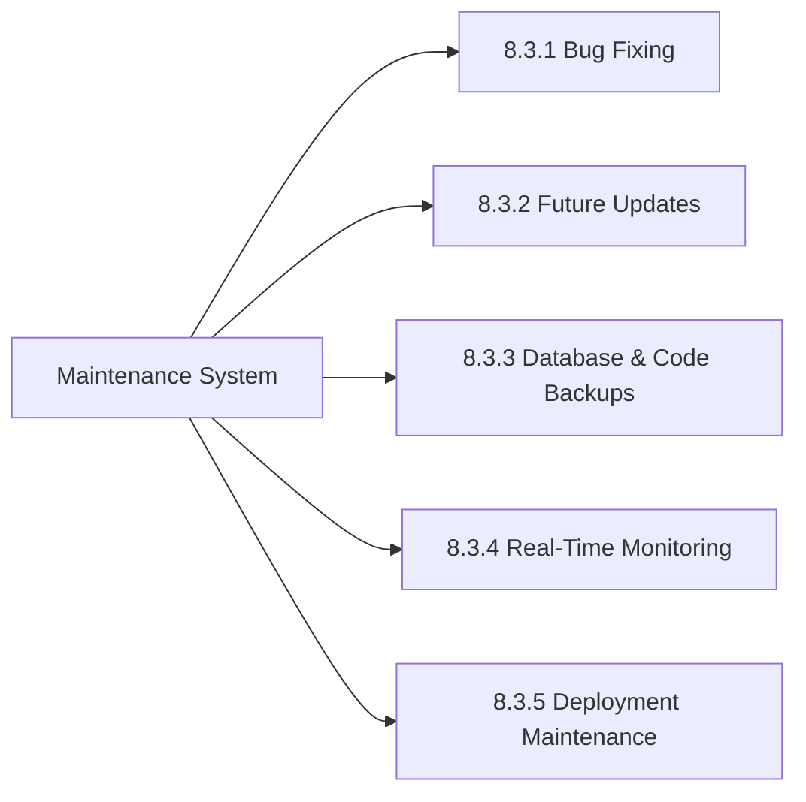

# CHAPTER – 8 : CONCLUSION AND FUTURE SCOPE

## 8.1 Conclusion

The development of the **Referral E-Commerce System** successfully demonstrates the integration of a multi-tiered marketing incentive model with a robust, modern full-stack web application. By utilizing the MERN (MongoDB, Express.js, React.js, Node.js) stack, the project has achieved all primary objectives established during the initial planning and design phases. 

The user storefront client delivers a responsive, fast-loading user interface using React and vanilla CSS, ensuring accessibility across desktop and mobile devices. Secure transaction handling is achieved through the integration of the Razorpay sandbox gateway. Dynamic payment signature checking protects the system from payload tampering and ensures that order entries are only marked as confirmed upon verified receipt of payment.

The main feature of the system—the dual-level referral commission distribution network—is managed reliably by the Express backend. By using atomic MongoDB update operations (`$inc`), the system eliminates concurrency risks, ensuring that parents are credited commissions correctly during simultaneous downline checkouts. Promoter wallets are updated in real time, and the withdrawal system successfully handles the exchange of earned wallet credits for secure, digital gift vouchers.

Furthermore, the centralized administrative console provides store managers with the tools needed to audit user signups, manage product categories, control inventory limits, and oversee withdrawals. Ultimately, this project proves that e-commerce architectures can successfully implement multi-level referral incentives while maintaining secure transaction handling, reliable database operations, and a seamless customer experience.

---

## 8.2 Future Scope

While the current Referral E-Commerce System is fully functional in the testing environment, several enhancements can be introduced in future iterations to increase its scalability, automation, and overall market capability:

1.  **Notification Systems**: Integrating transactional communication gateways, such as **Twilio** for SMS notifications and **Nodemailer** for automated email delivery. This will enable real-time alerts for downline signups, commission credits, order status updates, and digital voucher deliveries.
2.  **Automated Financial Disbursements**: Transitioning from gift coupon redemptions to direct financial payouts by integrating the **Razorpay Corporate Payouts API**. This will allow verified promoters to request direct-to-bank transfers or UPI transactions, automating the payout process.
3.  **Configurable Multi-Level Marketing (MLM) Engine**: Expanding the referral architecture to support deeper downline configurations, such as matrix or binary structures. Adding an administrative panel to customize commission rates per product or user rank will provide greater flexibility for promoters.
4.  **Advanced Administrative Analytics**: Incorporating data visualization libraries like **Chart.js** into the administrative dashboard. This will generate visual reports tracking system sales trajectories, registration signups, and commission payouts over time.
5.  **Location and Currency Expansion**: Adding multi-currency support and geo-location APIs to scale the platform globally, allowing users in different regions to interact with localized product catalogs and payout networks.

---

## 8.3 System Maintenance

Software maintenance is the final phase of the Software Development Life Cycle (SDLC) that ensures the system remains functional, secure, and compatible with evolving hardware and software environments. After successful deployment, the Referral E-Commerce System requires a structured maintenance strategy to handle daily operations, prevent performance bottlenecks, and resolve potential application failures. 

The maintenance system is organized around five core operational processes:



### 8.3.1 Bug Fixing

Operational software inevitably encounters unforeseen runtime errors and boundary issues that must be addressed immediately to ensure service continuity:
* **Error Log Rectification**: Checking developer logs to identify and resolve exceptions, such as unhandled routing errors or database connection drops during high network traffic.
* **Edge-Case Validation Patches**: Fixing issues like incorrect coupon formatting, cart quantity calculations, or database schema violations (e.g. attempting to force invalid direct downline additions).
* **UI/UX Defect Resolution**: Adjusting responsive styling breakpoints to ensure UI components render correctly across newer browser builds and mobile screen layouts.

### 8.3.2 Future Updates

To prevent technology obsolescence, the system must undergo periodic component upgrades:
* **Dependency Upgrades**: Regularly upgrading core NPM packages (such as `mongoose`, `express`, `jsonwebtoken`, and `react-router-dom`) to newer stable versions to leverage performance improvements and security patches.
* **Security Patching**: Addressing security advisories by executing `npm audit` and applying package updates to fix potential vulnerabilities in standard cryptographic libraries and utility modules.
* **Framework Upgrades**: Upgrading the React build system (Vite) and Node.js server runtimes to remain aligned with standard modern web development practices.

### 8.3.3 Database & Code Backups

Robust data backup policies protect the platform from permanent data loss caused by hardware failure, server crashes, or human error:
* **Automated NoSQL Database Dumps**: Establishing scheduled MongoDB backup routines using the standard `mongodump` utility:
  ```bash
  mongodump --uri="mongodb://localhost:27017/referral_ecommerce" --out=/backups/db/daily/
  ```
  In a cloud-hosted environment (MongoDB Atlas), utilizing automated cloud backup snapshots configured to run daily.
* **Version Control Archiving**: Committing source code updates to remote, secure repositories like GitHub or GitLab. Keeping the developmental branches separated ensures that working configurations can be restored instantly if new code introduces instability.

### 8.3.4 Real-Time Monitoring

Monitoring provides live system operational statistics, letting administrators identify performance bottlenecks and potential security threats proactively:
* **Request and Traffic Logs**: Implementing middleware loggers (e.g., `morgan` on the Express server) to trace every incoming API request method, target URL path, execution latency, and response status code.
* **Database Query Performance Monitoring**: Tracking MongoDB read/write execution times and index utilization to ensure that complex promoter searches (like recursive level-2 referrals tree construction) remain fast as user directories expand.
* **Console Logging**: Standardizing server-side error capturing (`try-catch` blocks) and streaming these errors to centralized developer consoles to minimize debugging downtime.

### 8.3.5 Deployment Maintenance

Managing environment parameters and server hosting configurations is critical for long-term application stability:
* **Environment Variable Governance**: Safely maintaining confidential parameters (e.g. `JWT_SECRET`, `RAZORPAY_KEY_SECRET`, and database connection strings) inside system-level `.env` files rather than exposing them in public code repositories.
* **Domain & SSL Maintenance**: Ensuring SSL/TLS certificates remain up to date to guarantee secure HTTPS connections, which are mandatory for Razorpay API integrations and secure JWT payload transmissions.
* **Server Scalability Checks**: Monitoring active server CPU and RAM usage to plan horizontal or vertical scaling when concurrent promoter actions scale up.

